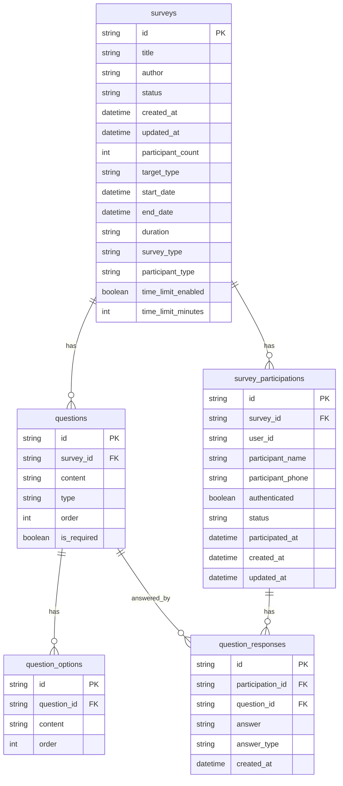

# KominioAI Survey System

## 📋 프로젝트 개요

KominioAI Survey System은 현대적인 설문조사 플랫폼으로, Hexagonal Architecture와 Domain-Driven Design을 기반으로 구축된 Spring Boot 3.x + Kotlin 기반의 리액티브 웹 애플리케이션입니다.

### 🎯 주요 기능

- **설문 생성 및 관리**: 다양한 유형의 설문 생성, 수정, 삭제
- **설문 참여**: 실시간 설문 참여 및 응답 수집
- **결과 분석**: 통계 분석 및 시각화
- **캐싱 시스템**: Redis 기반 성능 최적화
- **이벤트 기반 아키텍처**: 비동기 이벤트 처리
- **다국어 지원**: 한국어/영어 다국어 지원

### 🏗️ 아키텍처 특징

- **Hexagonal Architecture**: 도메인 중심의 의존성 역전
- **CQRS 패턴**: 명령과 조회의 분리
- **Event Sourcing**: 도메인 이벤트 기반 상태 관리
- **Reactive Programming**: WebFlux + R2DBC로 비동기 처리

## 🛠️ 기술 스택

### Backend

- **Language**: Kotlin 1.9+
- **Framework**: Spring Boot 3.2+
- **Web**: Spring WebFlux (Reactive)
- **Database**: PostgreSQL + R2DBC
- **Cache**: Redis
- **Build Tool**: Gradle 8.0+
- **Java Version**: JDK 17+

### 주요 라이브러리

```kotlin
dependencies {
    // Spring Boot
    implementation("org.springframework.boot:spring-boot-starter-webflux")
    implementation("org.springframework.boot:spring-boot-starter-data-r2dbc")
    implementation("org.springframework.boot:spring-boot-starter-data-redis")
    implementation("org.springframework.boot:spring-boot-starter-security")
    implementation("org.springframework.boot:spring-boot-starter-actuator")

    // Database
    implementation("org.postgresql:postgresql")
    implementation("io.r2dbc:r2dbc-postgresql")

    // Cache
    implementation("org.springframework.boot:spring-boot-starter-data-redis")

    // Monitoring
    implementation("io.micrometer:micrometer-registry-prometheus")

    // Excel Export
    implementation("org.apache.poi:poi-ooxml")

    // Testing
    testImplementation("org.springframework.boot:spring-boot-starter-test")
    testImplementation("io.projectreactor:reactor-test")
}
```

### 개발 도구

- **IDE**: IntelliJ IDEA
- **Database**: PostgreSQL 15+
- **Cache**: Redis 7+
- **API Documentation**: OpenAPI 3.0
- **Testing**: JUnit 5, Testcontainers

## 🏛️ 아키텍처

### Hexagonal Architecture (Port-Adapter Pattern)

```
┌─────────────────────────────────────────────────────────────┐
│                    Adapter Layer                            │
├─────────────────────────────────────────────────────────────┤
│  Web Adapter (REST API)  │  Event Adapter  │  Cache Adapter │
├─────────────────────────────────────────────────────────────┤
│                    Application Layer                        │
├─────────────────────────────────────────────────────────────┤
│  Use Cases  │  Application Services  │  Commands/Queries   │
├─────────────────────────────────────────────────────────────┤
│                    Domain Layer                             │
├─────────────────────────────────────────────────────────────┤
│  Entities  │  Value Objects  │  Domain Services  │  Events  │
├─────────────────────────────────────────────────────────────┤
│                    Infrastructure Layer                     │
├─────────────────────────────────────────────────────────────┤
│  Database  │  Cache  │  External Services  │  Monitoring   │
└─────────────────────────────────────────────────────────────┘
```

### 패키지 구조

```
com.kominioai
├── config/                    # 설정 클래스들
├── domain/                    # 도메인 모듈
│   ├── survey/               # 설문 도메인
│   │   ├── adapter/          # 어댑터 레이어
│   │   │   ├── in/          # 인바운드 어댑터
│   │   │   └── out/         # 아웃바운드 어댑터
│   │   ├── application/     # 애플리케이션 레이어
│   │   ├── domain/          # 도메인 레이어
│   │   └── infrastructure/  # 인프라 레이어
│   └── member/              # 회원 도메인
└── global/                   # 공통 모듈
    ├── common/              # 공통 유틸리티
    ├── config/              # 글로벌 설정
    ├── exception/           # 예외 처리
    └── security/            # 보안
```

### 도메인 모델

#### Survey Aggregate

```kotlin
class Survey(
    val id: SurveyId,
    private var title: SurveyTitle,
    val author: Author,
    private var status: SurveyStatus,
    private var period: SurveyPeriod,
    private var participationCount: ParticipationCount,
    val targetType: TargetType,
    val surveyType: SurveyType,
    val participantType: ParticipantType,
    val timeLimit: TimeLimit?,
    private val questions: MutableList<Question>,
    val createdAt: LocalDateTime,
    private var updatedAt: LocalDateTime
)
```

#### Question Entity

```kotlin
class Question(
    val id: QuestionId,
    private var content: String,
    val type: QuestionType,
    private var order: Int,
    private var isRequired: Boolean,
    private val options: MutableList<QuestionOption>
)
```

## 🗄️ 데이터베이스 설계

### ERD (Entity Relationship Diagram)



### 테이블 명세서

#### 1. surveys (설문 테이블)

| 컬럼명             | 타입         | NULL     | 기본값            | 설명            |
| ------------------ | ------------ | -------- | ----------------- | --------------- |
| id                 | VARCHAR(50)  | NOT NULL | -                 | 설문 ID (PK)    |
| title              | VARCHAR(200) | NOT NULL | -                 | 설문 제목       |
| author             | VARCHAR(100) | NOT NULL | -                 | 작성자          |
| status             | VARCHAR(20)  | NOT NULL | 'DRAFT'           | 설문 상태       |
| created_at         | TIMESTAMP    | NOT NULL | CURRENT_TIMESTAMP | 생성일시        |
| updated_at         | TIMESTAMP    | NOT NULL | CURRENT_TIMESTAMP | 수정일시        |
| participant_count  | INTEGER      | NOT NULL | 0                 | 참여자 수       |
| target_type        | VARCHAR(20)  | NOT NULL | 'ALL'             | 대상 타입       |
| start_date         | TIMESTAMP    | NULL     | -                 | 시작일시        |
| end_date           | TIMESTAMP    | NULL     | -                 | 종료일시        |
| duration           | VARCHAR(100) | NOT NULL | -                 | 기간 표시       |
| survey_type        | VARCHAR(20)  | NOT NULL | 'SURVEY'          | 설문 타입       |
| participant_type   | VARCHAR(20)  | NOT NULL | 'MEMBER'          | 참여자 타입     |
| time_limit_enabled | BOOLEAN      | NULL     | false             | 시간제한 활성화 |
| time_limit_minutes | INTEGER      | NULL     | -                 | 시간제한(분)    |

#### 2. questions (질문 테이블)

| 컬럼명      | 타입         | NULL     | 기본값 | 설명         |
| ----------- | ------------ | -------- | ------ | ------------ |
| id          | VARCHAR(50)  | NOT NULL | -      | 질문 ID (PK) |
| survey_id   | VARCHAR(50)  | NOT NULL | -      | 설문 ID (FK) |
| content     | VARCHAR(500) | NOT NULL | -      | 질문 내용    |
| type        | VARCHAR(30)  | NOT NULL | -      | 질문 타입    |
| order       | INTEGER      | NOT NULL | -      | 질문 순서    |
| is_required | BOOLEAN      | NOT NULL | false  | 필수 여부    |

#### 3. question_options (질문 옵션 테이블)

| 컬럼명      | 타입         | NULL     | 기본값 | 설명         |
| ----------- | ------------ | -------- | ------ | ------------ |
| id          | VARCHAR(50)  | NOT NULL | -      | 옵션 ID (PK) |
| question_id | VARCHAR(50)  | NOT NULL | -      | 질문 ID (FK) |
| content     | VARCHAR(200) | NOT NULL | -      | 옵션 내용    |
| order       | INTEGER      | NOT NULL | -      | 옵션 순서    |

#### 4. survey_participations (설문 참여 테이블)

| 컬럼명            | 타입         | NULL     | 기본값            | 설명            |
| ----------------- | ------------ | -------- | ----------------- | --------------- |
| id                | VARCHAR(50)  | NOT NULL | -                 | 참여 ID (PK)    |
| survey_id         | VARCHAR(50)  | NOT NULL | -                 | 설문 ID (FK)    |
| user_id           | VARCHAR(50)  | NULL     | -                 | 사용자 ID       |
| participant_name  | VARCHAR(100) | NULL     | -                 | 참여자 이름     |
| participant_phone | VARCHAR(20)  | NULL     | -                 | 참여자 전화번호 |
| authenticated     | BOOLEAN      | NOT NULL | false             | 인증 여부       |
| status            | VARCHAR(20)  | NOT NULL | 'COMPLETED'       | 참여 상태       |
| participated_at   | TIMESTAMP    | NOT NULL | CURRENT_TIMESTAMP | 참여일시        |
| created_at        | TIMESTAMP    | NOT NULL | CURRENT_TIMESTAMP | 생성일시        |
| updated_at        | TIMESTAMP    | NOT NULL | CURRENT_TIMESTAMP | 수정일시        |

#### 5. question_responses (질문 응답 테이블)

| 컬럼명           | 타입        | NULL     | 기본값            | 설명         |
| ---------------- | ----------- | -------- | ----------------- | ------------ |
| id               | VARCHAR(50) | NOT NULL | -                 | 응답 ID (PK) |
| participation_id | VARCHAR(50) | NOT NULL | -                 | 참여 ID (FK) |
| question_id      | VARCHAR(50) | NOT NULL | -                 | 질문 ID (FK) |
| answer           | TEXT        | NULL     | -                 | 응답 내용    |
| answer_type      | VARCHAR(20) | NOT NULL | 'STRING'          | 응답 타입    |
| created_at       | TIMESTAMP   | NOT NULL | CURRENT_TIMESTAMP | 생성일시     |

### 인덱스 설계

```sql
-- 설문 조회 성능 최적화
CREATE INDEX idx_surveys_status ON surveys(status);
CREATE INDEX idx_surveys_author ON surveys(author);
CREATE INDEX idx_surveys_created_at ON surveys(created_at);
CREATE INDEX idx_surveys_period ON surveys(start_date, end_date);

-- 질문 조회 성능 최적화
CREATE INDEX idx_questions_survey_id ON questions(survey_id);
CREATE INDEX idx_questions_order ON questions(survey_id, "order");

-- 참여 조회 성능 최적화
CREATE INDEX idx_participations_survey_id ON survey_participations(survey_id);
CREATE INDEX idx_participations_user_id ON survey_participations(user_id);
CREATE INDEX idx_participations_participated_at ON survey_participations(participated_at);

-- 응답 조회 성능 최적화
CREATE INDEX idx_responses_participation_id ON question_responses(participation_id);
CREATE INDEX idx_responses_question_id ON question_responses(question_id);
```

## 🔌 API 문서

### Base URL

```
http://localhost:8080/api/v1
```

### 인증

```
Basic Authentication
Username: user
Password: password
```

### 1. 설문 관리 API

#### 1.1 설문 목록 조회

```http
GET /surveys?title={title}&author={author}&status={status}&page={page}&size={size}
```

**Request Parameters:**

- `title` (optional): 설문 제목 검색
- `author` (optional): 작성자 검색
- `status` (optional): 설문 상태 (DRAFT, PUBLISHED, COMPLETED, CLOSED)
- `page` (default: 1): 페이지 번호
- `size` (default: 10): 페이지 크기

**Response:**

```json
{
  "total": 100,
  "surveys": [
    {
      "id": 1,
      "title": "고객 만족도 조사",
      "author": "김철수",
      "participantCount": 150,
      "targetType": "ALL",
      "status": "PUBLISHED",
      "createdAt": "2024-01-15T10:00:00",
      "startDate": "2024-01-16T00:00:00",
      "endDate": "2024-01-31T23:59:59",
      "duration": "2024-01-16 ~ 2024-01-31"
    }
  ]
}
```

#### 1.2 설문 생성

```http
POST /surveys
Content-Type: application/json
```

**Request Body:**

```json
{
  "title": "신제품 만족도 조사",
  "author": "김철수",
  "startDate": "2024-01-16T00:00:00",
  "endDate": "2024-01-31T23:59:59",
  "surveyType": "SURVEY",
  "participantType": "ALL",
  "timeLimit": {
    "enabled": true,
    "minutes": 30
  },
  "questions": [
    {
      "content": "신제품에 대한 전반적인 만족도는 어떠신가요?",
      "type": "MULTIPLE_CHOICE",
      "order": 1,
      "options": ["매우 만족", "만족", "보통", "불만족", "매우 불만족"]
    },
    {
      "content": "추가로 개선하고 싶은 부분이 있다면 자유롭게 작성해주세요.",
      "type": "ESSAY",
      "order": 2
    }
  ]
}
```

**Response:**

```json
{
  "id": 123
}
```

#### 1.3 설문 수정

```http
PUT /surveys/{id}
Content-Type: application/json
```

**Request Body:** (CreateSurveyCommand와 동일)

#### 1.4 설문 삭제

```http
DELETE /surveys
Content-Type: application/json
```

**Request Body:**

```json
[1, 2, 3]
```

#### 1.5 설문 상세 조회

```http
GET /surveys/{surveyId}/detail?userId={userId}
```

**Response:**

```json
{
  "id": 1,
  "title": "신제품 만족도 조사",
  "author": "김철수",
  "status": "PUBLISHED",
  "type": "설문",
  "createdAt": "2024-01-15T10:00:00",
  "updatedAt": "2024-01-15T10:00:00",
  "displayInfo": {
    "statusMessage": "현재 참여 인원은 150명입니다. (참여율: 75.0%)",
    "buttonInfo": {
      "text": "설문 참여하기",
      "enabled": true,
      "cssClass": "btn-primary",
      "action": "/surveys/1/participate"
    },
    "themeInfo": {
      "primaryColor": "#1976d2",
      "secondaryColor": "#90caf9",
      "iconType": "chart",
      "cssClassName": "survey-type-survey",
      "animationType": "fade-in"
    },
    "participationInfo": "COMPLETED",
    "requirementInfo": "REQUIRED"
  },
  "questions": [
    {
      "number": 1,
      "content": "신제품에 대한 전반적인 만족도는 어떠신가요?",
      "type": "MULTIPLE_CHOICE",
      "icon": "☑️",
      "required": true
    }
  ],
  "totalQuestionCount": 2,
  "hasMoreQuestions": false,
  "navigation": {
    "prevSurveyId": null,
    "nextSurveyId": null,
    "breadcrumb": ["홈", "설문 목록", "설문 상세보기"]
  }
}
```

### 2. 설문 참여 API

#### 2.1 설문 참여

```http
POST /surveys/{surveyId}/participate
Content-Type: application/json
```

**Request Body:**

```json
{
  "surveyId": "1",
  "participant": {
    "userId": "user123",
    "name": "홍길동",
    "phone": "010-1234-5678",
    "authenticated": true
  },
  "responses": [
    {
      "questionId": "q1",
      "answer": "매우 만족"
    },
    {
      "questionId": "q2",
      "answer": "가격이 조금 비싸다고 생각합니다."
    }
  ]
}
```

### 3. 설문 결과 API

#### 3.1 설문 결과 조회

```http
GET /surveys/{surveyId}/results?userId={userId}
```

**Response:**

```json
{
  "surveyId": "1",
  "totalParticipants": 150,
  "questions": [
    {
      "questionId": "q1",
      "type": "MULTIPLE_CHOICE",
      "content": "신제품에 대한 전반적인 만족도는 어떠신가요?",
      "choices": [
        {
          "optionId": "opt1",
          "content": "매우 만족",
          "selectedCount": 45,
          "percentage": 30.0,
          "rank": 1
        },
        {
          "optionId": "opt2",
          "content": "만족",
          "selectedCount": 60,
          "percentage": 40.0,
          "rank": 2
        }
      ]
    },
    {
      "questionId": "q2",
      "type": "ESSAY",
      "content": "추가로 개선하고 싶은 부분이 있다면 자유롭게 작성해주세요.",
      "subjectiveAnswers": [
        "가격이 조금 비싸다고 생각합니다.",
        "디자인이 더 예쁘면 좋겠어요.",
        "기능이 너무 복잡해요."
      ]
    }
  ],
  "calculatedAt": "2024-01-15T15:30:00"
}
```

#### 3.2 설문 결과 엑셀 다운로드

```http
GET /surveys/{id}/export
Accept: application/vnd.openxmlformats-officedocument.spreadsheetml.sheet
```

### 4. 사용자 설문 목록 API

#### 4.1 사용자 설문 목록 조회

```http
GET /surveys/user?title={title}&status={status}&surveyType={surveyType}&start={start}&end={end}&page={page}&size={size}
```

**Response:**

```json
{
  "totalCount": 50,
  "surveys": [
    {
      "number": 50,
      "id": 1,
      "title": "고객 만족도 조사",
      "author": "김철수",
      "status": "게시",
      "surveyType": "설문",
      "period": "2024-01-16 ~ 2024-01-31",
      "createdAt": "2024-01-15"
    }
  ]
}
```

## 🚀 실행 방법

### 1. 환경 요구사항

- JDK 17+
- PostgreSQL 15+
- Redis 7+
- Gradle 8.0+

### 2. 데이터베이스 설정

```sql
-- PostgreSQL 데이터베이스 생성
CREATE DATABASE kominioai_survey;

-- 사용자 생성 (선택사항)
CREATE USER kominioai_user WITH PASSWORD 'your_password';
GRANT ALL PRIVILEGES ON DATABASE kominioai_survey TO kominioai_user;
```

### 3. 애플리케이션 실행

```bash
# 프로젝트 클론
git clone https://github.com/your-username/kominioai-survey.git
cd kominioai-survey

# 환경 설정
cp src/main/resources/application-local.yml.example src/main/resources/application-local.yml
# application-local.yml 파일에서 데이터베이스 연결 정보 수정

# 애플리케이션 실행
./gradlew bootRun
```

### 4. 환경별 설정

- **Local**: `application-local.yml`
- **Development**: `application-dev.yml`
- **Production**: `application-prod.yml`
- **Test**: `application-test.yml`

## 📊 모니터링

### Actuator Endpoints

- **Health Check**: `GET /actuator/health`
- **Metrics**: `GET /actuator/metrics`
- **Redis Health**: `GET /actuator/health/redis`
- **Database Health**: `GET /actuator/health/db`

### 주요 메트릭

- 설문 생성/수정/삭제 횟수
- 설문 참여율
- API 응답 시간
- 캐시 히트율
- 데이터베이스 연결 상태

## 🔧 개발 가이드

### 코드 컨벤션

- **Kotlin**: Kotlin 코딩 컨벤션 준수
- **Naming**: camelCase 사용
- **Package**: 도메인 중심 패키지 구조
- **Documentation**: KDoc 사용

### 테스트 실행

```bash
# 전체 테스트 실행
./gradlew test

# 특정 테스트 실행
./gradlew test --tests SurveyApplicationServiceTest

# 통합 테스트 실행
./gradlew integrationTest
```

### 빌드 및 배포

```bash
# JAR 파일 빌드
./gradlew build

# Docker 이미지 빌드
docker build -t kominioai-survey .

# Docker 실행
docker run -p 8080:8080 kominioai-survey
```

## 🤝 기여 가이드

1. Fork the repository
2. Create your feature branch (`git checkout -b feature/amazing-feature`)
3. Commit your changes (`git commit -m 'Add some amazing feature'`)
4. Push to the branch (`git push origin feature/amazing-feature`)
5. Open a Pull Request

## 📄 라이선스

이 프로젝트는 MIT 라이선스 하에 배포됩니다. 자세한 내용은 [LICENSE](LICENSE) 파일을 참조하세요.

## 📞 문의

프로젝트에 대한 문의사항이 있으시면 이슈를 생성해주세요.

---

**KominioAI Survey System** - 현대적인 설문조사 플랫폼
