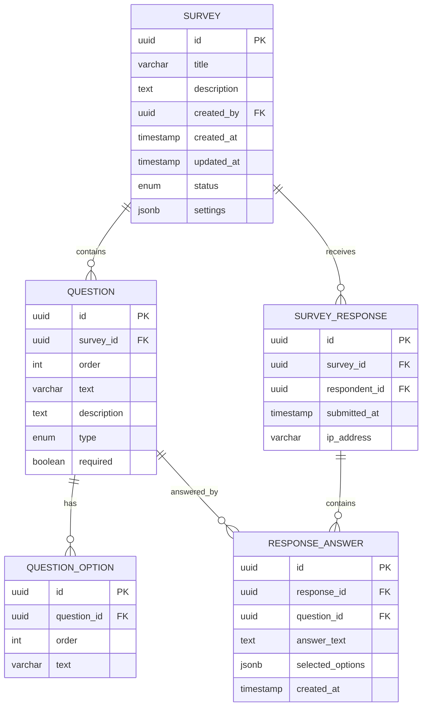

# KominioAI Survey Management System

[](https://kotlinlang.org/)
[](https://spring.io/projects/spring-boot)
[](https://openjdk.java.net/)
[](https://r2dbc.io/)
[](https://redis.io/)

## 📋 목차

- [프로젝트 개요](#프로젝트-개요)
- [기술 스택](#기술-스택)
- [아키텍처](#아키텍처)
- [데이터베이스 설계](#데이터베이스-설계)
- [설치 및 실행](#설치-및-실행)
- [API 문서](#api-문서)
- [개발 가이드](#개발-가이드)
- [테스트](#테스트)
- [성능 최적화](#성능-최적화)
- [모니터링](#모니터링)
- [배포](#배포)
- [기여 가이드](#기여-가이드)

## 🎯 프로젝트 개요

KominioAI Survey Management System은 **Hexagonal Architecture (Clean Architecture)** 기반의 설문조사 관리 시스템입니다.

### 주요 기능

- ✅ 설문조사 생성 및 관리
- ✅ 다양한 질문 유형 지원 (단답형, 객관식, 다중선택, 평점 등)
- ✅ 실시간 응답 수집 및 통계
- ✅ 캐싱을 통한 성능 최적화
- ✅ 이벤트 기반 아키텍처
- ✅ 메트릭 수집 및 모니터링
- ✅ 보안 및 인증
- ✅ API 문서화

### 비즈니스 도메인

- **Survey Domain**: 설문조사 생명주기 관리
- **Question Domain**: 질문 및 옵션 관리
- **Response Domain**: 응답 수집 및 분석
- **Statistics Domain**: 통계 및 분석

## 🛠 기술 스택

### Backend

- **Language**: Kotlin 1.9.25
- **Framework**: Spring Boot 3.4.5 (WebFlux)
- **Database**: PostgreSQL + R2DBC (Reactive)
- **Cache**: Redis (Reactive)
- **Security**: Spring Security + OAuth2
- **Documentation**: OpenAPI 3.0

### Monitoring & Observability

- **Metrics**: Micrometer + Prometheus
- **Tracing**: Brave
- **Logging**: Logback + Logstash Encoder

### Testing

- **Unit Testing**: Kotest + MockK
- **Integration Testing**: Testcontainers
- **Performance Testing**: JMH
- **Load Testing**: Custom Load Test Framework

### Development Tools

- **Build Tool**: Gradle 8.x
- **Code Quality**: KtLint
- **Coverage**: JaCoCo
- **Container**: Docker

## 🏗 아키텍처

### Hexagonal Architecture (Clean Architecture)

```
┌─────────────────────────────────────────────────────────────┐
│                    Presentation Layer                       │
├─────────────────────────────────────────────────────────────┤
│  Controllers  │  DTOs  │  Validators  │  Exception Handlers │
└─────────────────────────────────────────────────────────────┘
                                │
┌─────────────────────────────────────────────────────────────┐
│                    Application Layer                        │
├─────────────────────────────────────────────────────────────┤
│  Use Cases  │  Application Services  │  Ports (Interfaces)  │
└─────────────────────────────────────────────────────────────┘
                                │
┌─────────────────────────────────────────────────────────────┐
│                     Domain Layer                            │
├─────────────────────────────────────────────────────────────┤
│  Entities  │  Value Objects  │  Domain Services  │  Events  │
└─────────────────────────────────────────────────────────────┘
                                │
┌─────────────────────────────────────────────────────────────┐
│                  Infrastructure Layer                       │
├─────────────────────────────────────────────────────────────┤
│  Repositories  │  Cache  │  Event Publishers  │  External APIs │
└─────────────────────────────────────────────────────────────┘
```

### 패키지 구조

```
src/main/kotlin/com/kominioai/
├── domain/
│   └── survey/
│       ├── application/           # Application Layer
│       │   ├── port/
│       │   │   ├── input/         # Input Ports (Commands, Queries)
│       │   │   └── output/        # Output Ports (Repositories, EventPublisher)
│       │   └── service/           # Application Services
│       ├── domain/                # Domain Layer
│       │   ├── model/
│       │   │   ├── domain/        # Domain Entities
│       │   │   ├── event/         # Domain Events
│       │   │   └── service/       # Domain Services
│       │   └── valueobject/       # Value Objects
│       ├── infrastructure/        # Infrastructure Layer
│       │   ├── cache/             # Redis Cache Implementation
│       │   ├── event/             # Event Publishing
│       │   └── persistence/       # R2DBC Implementation
│       └── presentation/          # Presentation Layer
│           └── rest/
│               ├── controller/    # REST Controllers
│               └── dto/           # Data Transfer Objects
└── global/                        # Cross-cutting Concerns
    ├── config/                    # Configuration
    ├── controller/                # Global Controllers
    ├── exception/                 # Exception Handling
    ├── service/                   # Global Services
    ├── util/                      # Utilities
    └── validation/                # Validation
```

### 이벤트 기반 아키텍처

```
┌─────────────┐    ┌─────────────┐    ┌─────────────┐
│   Domain    │    │   Event     │    │   Event     │
│   Service   │───▶│  Publisher  │───▶│  Listeners  │
└─────────────┘    └─────────────┘    └─────────────┘
                           │
                    ┌─────────────┐
                    │   Cache     │
                    │ Invalidation│
                    └─────────────┘
```

## 🗄 데이터베이스 설계

### ERD (Entity Relationship Diagram)



### 테이블 상세

#### SURVEY

- 설문조사의 기본 정보를 저장
- 상태 관리 (DRAFT, PUBLISHED, CLOSED, COMPLETED)
- 설정 정보는 JSONB로 저장

#### QUESTION

- 설문조사의 질문 정보
- 다양한 질문 유형 지원
- 순서 정보로 정렬 관리

#### QUESTION_OPTION

- 객관식 질문의 선택지
- 순서 정보로 정렬 관리

#### SURVEY_RESPONSE

- 설문조사 응답의 메타데이터
- 응답자 정보 및 제출 시간

#### RESPONSE_ANSWER

- 개별 질문에 대한 답변
- 텍스트 답변과 선택된 옵션을 모두 저장

## 🚀 설치 및 실행

### 필수 요구사항

- Java 21+
- Kotlin 1.9.25+
- PostgreSQL 15+
- Redis 7+
- Gradle 8.x+

### 환경 설정

1. **Repository 클론**

```bash
git clone https://github.com/kominioai/survey-backend.git
cd survey-backend
```

2. **환경 변수 설정**

```bash
cp .env.example .env
```

`.env` 파일 설정:

```properties
# Database
DB_HOST=localhost
DB_PORT=5432
DB_NAME=survey_db
DB_USERNAME=survey_user
DB_PASSWORD=survey_password

# Redis
REDIS_HOST=localhost
REDIS_PORT=6379
REDIS_PASSWORD=

# Application
SERVER_PORT=8080
SPRING_PROFILES_ACTIVE=dev
```

3. **데이터베이스 설정**

```sql
CREATE DATABASE survey_db;
CREATE USER survey_user WITH PASSWORD 'survey_password';
GRANT ALL PRIVILEGES ON DATABASE survey_db TO survey_user;
```

4. **애플리케이션 실행**

```bash
# 개발 모드
./gradlew bootRun

# 또는 특정 프로파일로 실행
./gradlew bootRun --args='--spring.profiles.active=dev'
```

### Docker 실행

```bash
# Docker Compose로 전체 환경 실행
docker-compose up -d

# 애플리케이션만 실행
docker run -p 8080:8080 kominioai/survey-backend:latest
```

## 📚 API 문서

### OpenAPI 문서

- **Swagger UI**: http://localhost:8080/swagger-ui.html
- **OpenAPI JSON**: http://localhost:8080/v3/api-docs

### 주요 API 엔드포인트

#### 설문조사 관리

```http
POST   /api/surveys                    # 설문조사 생성
GET    /api/surveys                    # 설문조사 목록 조회
GET    /api/surveys/{id}               # 설문조사 상세 조회
PUT    /api/surveys/{id}/publish       # 설문조사 게시
DELETE /api/surveys/{id}               # 설문조사 삭제
```

#### 질문 관리

```http
POST   /api/surveys/{id}/questions     # 질문 추가
PUT    /api/surveys/{id}/questions/{questionId}  # 질문 수정
DELETE /api/surveys/{id}/questions/{questionId}  # 질문 삭제
```

#### 응답 관리

```http
POST   /api/surveys/{id}/responses     # 응답 제출
GET    /api/surveys/{id}/responses     # 응답 목록 조회
GET    /api/surveys/{id}/statistics    # 통계 조회
```

#### 캐시 관리

```http
GET    /api/cache/stats                # 캐시 통계
POST   /api/cache/invalidate           # 캐시 무효화
```

#### 메트릭

```http
GET    /api/metrics/summary            # 메트릭 요약
GET    /api/metrics/performance        # 성능 메트릭
GET    /api/metrics/business           # 비즈니스 메트릭
```

### API 사용 예시

#### 설문조사 생성

```bash
curl -X POST http://localhost:8080/api/surveys \
  -H "Content-Type: application/json" \
  -d '{
    "title": "고객 만족도 조사",
    "description": "서비스 개선을 위한 고객 만족도 조사입니다.",
    "settings": {
      "allowAnonymous": true,
      "allowMultipleResponses": false,
      "requireLogin": false,
      "collectIpAddress": true
    }
  }'
```

#### 질문 추가

```bash
curl -X POST http://localhost:8080/api/surveys/{surveyId}/questions \
  -H "Content-Type: application/json" \
  -d '{
    "text": "서비스에 만족하시나요?",
    "type": "SINGLE_CHOICE",
    "required": true,
    "options": ["매우 만족", "만족", "보통", "불만족", "매우 불만족"]
  }'
```

#### 응답 제출

```bash
curl -X POST http://localhost:8080/api/surveys/{surveyId}/responses \
  -H "Content-Type: application/json" \
  -d '{
    "answers": [
      {
        "questionId": "question-id",
        "answerText": null,
        "selectedOptionIds": ["option-id-1"]
      }
    ]
  }'
```

## 👨‍💻 개발 가이드

### 개발 환경 설정

1. **IDE 설정**

   - IntelliJ IDEA 또는 VS Code 권장
   - Kotlin 플러그인 설치
   - Spring Boot 플러그인 설치

2. **코드 스타일**

   - KtLint 사용
   - Kotlin 코딩 컨벤션 준수
   - 4칸 들여쓰기

3. **Git 설정**

```bash
# 커밋 메시지 컨벤션
feat: 새로운 기능 추가
fix: 버그 수정
docs: 문서 수정
style: 코드 스타일 변경
refactor: 코드 리팩토링
test: 테스트 추가/수정
chore: 빌드 설정 변경
```

### 아키텍처 패턴

#### 1. Use Case 패턴

```kotlin
@Service
class CreateSurveyUseCase(
    private val surveyRepository: SurveyRepository
) {
    fun execute(command: CreateSurveyCommand): Mono<SurveyId> {
        val survey = Survey.create(
            title = command.title,
            description = command.description,
            createdBy = command.createdBy,
            settings = command.settings
        )
        return surveyRepository.save(survey).map { it.id }
    }
}
```

#### 2. Domain Event 패턴

```kotlin
// Domain Event 정의
data class SurveyCreated(
    val surveyId: SurveyId,
    val title: String,
    val createdBy: UserId
) : SurveyEvent

// Event Publisher 사용
eventPublisher.publishReactive(SurveyCreated(survey.id, survey.title, survey.createdBy))
```

#### 3. Repository 패턴

```kotlin
interface SurveyRepository {
    fun save(survey: Survey): Mono<Survey>
    fun findById(id: SurveyId): Mono<Survey>
    fun findAll(): Flux<Survey>
}
```

### 테스트 작성

#### Unit Test

```kotlin
@Test
fun `설문조사 생성 성공`() {
    // Given
    val command = CreateSurveyCommand(
        title = "테스트 설문",
        description = "테스트용 설문조사",
        createdBy = UserId.generate(),
        settings = SurveySettings()
    )

    // When
    val result = createSurveyUseCase.execute(command).block()

    // Then
    assertThat(result).isNotNull()
    assertThat(result).isInstanceOf(SurveyId::class.java)
}
```

#### Integration Test

```kotlin
@SpringBootTest
@Testcontainers
class SurveyIntegrationTest {
    @Container
    val postgres = PostgreSQLContainer("postgres:15")

    @Test
    fun `설문조사 생성 및 조회 통합 테스트`() {
        // 테스트 로직
    }
}
```

## 🧪 테스트

### 테스트 실행

```bash
# 전체 테스트 실행
./gradlew test

# 특정 테스트 클래스 실행
./gradlew test --tests SurveyServiceTest

# 통합 테스트 실행
./gradlew integrationTest

# 성능 테스트 실행
./gradlew jmh

# 커버리지 리포트 생성
./gradlew jacocoTestReport
```

### 테스트 구조

```
src/test/kotlin/
├── unit/                    # 단위 테스트
├── integration/             # 통합 테스트
├── performance/             # 성능 테스트
└── load/                    # 부하 테스트
```

### 테스트 커버리지

- **목표**: 80% 이상
- **도구**: JaCoCo
- **리포트**: `build/reports/jacoco/test/html/index.html`

## ⚡ 성능 최적화

### 캐싱 전략

1. **Redis 캐싱**

   - 설문조사 조회: 30분 TTL
   - 통계 데이터: 1시간 TTL
   - 게시된 설문 목록: 15분 TTL

2. **캐시 무효화**
   - 설문 수정 시 관련 캐시 무효화
   - 응답 제출 시 통계 캐시 무효화

### 데이터베이스 최적화

1. **인덱스**

```sql
-- 설문조사 조회 최적화
CREATE INDEX idx_survey_status ON survey(status);
CREATE INDEX idx_survey_created_by ON survey(created_by);

-- 응답 조회 최적화
CREATE INDEX idx_response_survey_id ON survey_response(survey_id);
CREATE INDEX idx_response_submitted_at ON survey_response(submitted_at);
```

2. **쿼리 최적화**
   - N+1 문제 방지를 위한 JOIN 사용
   - 페이징 처리로 대용량 데이터 처리

### 비동기 처리

1. **이벤트 처리**

   - 이벤트 리스너를 통한 비동기 처리
   - 백그라운드 작업 분리

2. **Reactive 스트림**
   - WebFlux를 통한 비동기 HTTP 처리
   - 백프레셔 지원

## 📊 모니터링

### 메트릭 수집

1. **애플리케이션 메트릭**

   - API 응답 시간
   - 에러율
   - 처리량

2. **비즈니스 메트릭**

   - 설문조사 생성 수
   - 응답 제출 수
   - 캐시 히트율

3. **시스템 메트릭**
   - JVM 메모리 사용량
   - 스레드 수
   - 데이터베이스 연결 풀

### 로깅

1. **구조화된 로깅**

```kotlin
StructuredLogging.logInfo(
    logger,
    "Survey created successfully",
    "surveyId" to survey.id.value,
    "title" to survey.title,
    "createdBy" to survey.createdBy.value
)
```

2. **로그 레벨**
   - ERROR: 시스템 오류
   - WARN: 경고 상황
   - INFO: 중요 비즈니스 이벤트
   - DEBUG: 디버깅 정보

### 알림

1. **성능 알림**

   - 응답 시간 임계값 초과
   - 에러율 임계값 초과
   - 메모리 사용량 임계값 초과

2. **비즈니스 알림**
   - 설문조사 마일스톤 달성
   - 응답 수 임계값 달성

## 🚀 배포

### Docker 배포

```bash
# 이미지 빌드
./gradlew bootBuildImage

# 컨테이너 실행
docker run -d \
  -p 8080:8080 \
  -e SPRING_PROFILES_ACTIVE=prod \
  -e DB_HOST=your-db-host \
  -e REDIS_HOST=your-redis-host \
  kominioai/survey-backend:latest
```

### Kubernetes 배포

```yaml
apiVersion: apps/v1
kind: Deployment
metadata:
  name: survey-backend
spec:
  replicas: 3
  selector:
    matchLabels:
      app: survey-backend
  template:
    metadata:
      labels:
        app: survey-backend
    spec:
      containers:
        - name: survey-backend
          image: kominioai/survey-backend:latest
          ports:
            - containerPort: 8080
          env:
            - name: SPRING_PROFILES_ACTIVE
              value: "prod"
```

### CI/CD 파이프라인

```yaml
# GitHub Actions 예시
name: CI/CD Pipeline
on:
  push:
    branches: [main]
  pull_request:
    branches: [main]

jobs:
  test:
    runs-on: ubuntu-latest
    steps:
      - uses: actions/checkout@v3
      - name: Run tests
        run: ./gradlew test
      - name: Generate coverage report
        run: ./gradlew jacocoTestReport

  build:
    needs: test
    runs-on: ubuntu-latest
    steps:
      - name: Build Docker image
        run: ./gradlew bootBuildImage
      - name: Push to registry
        run: docker push kominioai/survey-backend:latest
```

## 🤝 기여 가이드

### 기여 프로세스

1. **Fork & Clone**

```bash
git clone https://github.com/your-username/survey-backend.git
cd survey-backend
```

2. **브랜치 생성**

```bash
git checkout -b feature/your-feature-name
```

3. **개발 및 테스트**

```bash
# 코드 작성
./gradlew test
./gradlew ktlintCheck
```

4. **커밋 및 푸시**

```bash
git add .
git commit -m "feat: 새로운 기능 추가"
git push origin feature/your-feature-name
```

5. **Pull Request 생성**
   - GitHub에서 Pull Request 생성
   - 리뷰어 지정
   - 코드 리뷰 후 머지

### 코딩 컨벤션

1. **Kotlin 컨벤션**

   - 함수명: camelCase
   - 클래스명: PascalCase
   - 상수: UPPER_SNAKE_CASE

2. **주석 작성**

```kotlin
/**
 * 설문조사를 생성합니다.
 *
 * @param command 설문조사 생성 명령
 * @return 생성된 설문조사 ID
 * @throws SurveyValidationException 유효하지 않은 데이터인 경우
 */
fun createSurvey(command: CreateSurveyCommand): Mono<SurveyId>
```

3. **예외 처리**

```kotlin
try {
    // 비즈니스 로직
} catch (e: Exception) {
    logger.error("Error occurred: ${e.message}", e)
    throw BusinessException("처리 중 오류가 발생했습니다.")
}
```

## 📄 라이선스

이 프로젝트는 MIT 라이선스 하에 배포됩니다. 자세한 내용은 [LICENSE](LICENSE) 파일을 참조하세요.

## 📞 연락처

- **프로젝트 관리자**: KominioAI Team
- **이메일**: contact@kominioai.com
- **GitHub**: https://github.com/kominioai/survey-backend
- **문서**: https://docs.kominioai.com

## 🙏 감사의 말

이 프로젝트는 다음과 같은 오픈소스 프로젝트들의 도움을 받았습니다:

- [Spring Boot](https://spring.io/projects/spring-boot)
- [Kotlin](https://kotlinlang.org/)
- [R2DBC](https://r2dbc.io/)
- [Redis](https://redis.io/)
- [Micrometer](https://micrometer.io/)

---

**KominioAI Survey Management System** - 설문조사 관리의 새로운 패러다임 🚀
