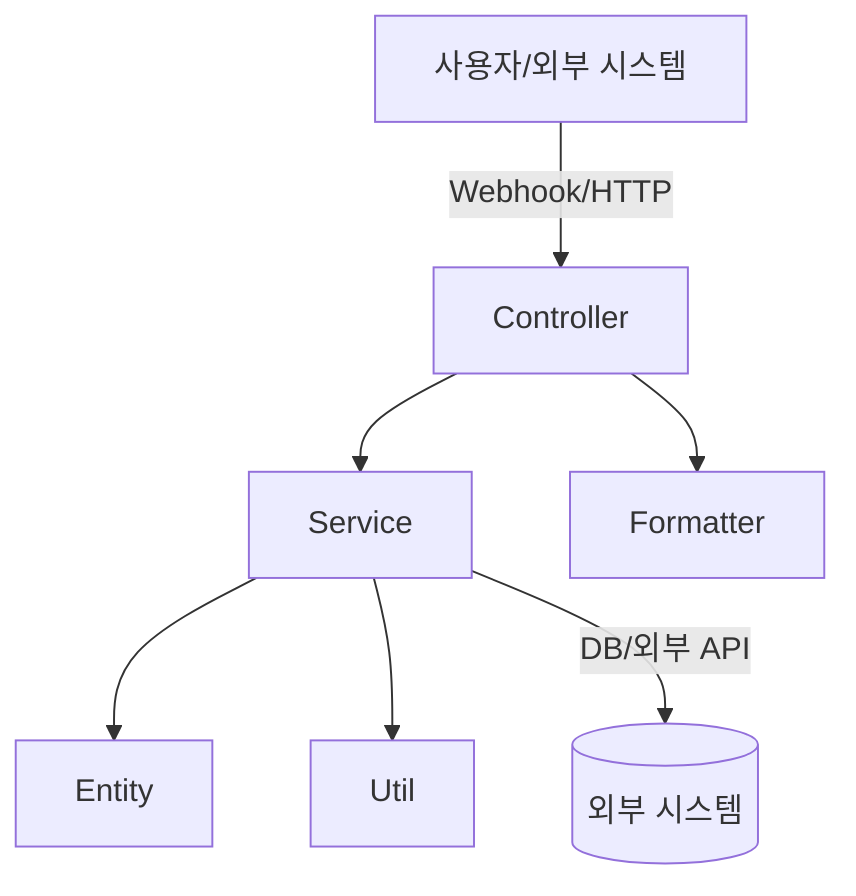

# KoBot

## 개요

KoBot은 Discord 및 Slack과 연동하여 다양한 메시지 처리 및 알림 기능을 제공하는 Kotlin 기반의 봇 애플리케이션입니다.

---

## 아키텍처



- **Controller**: 외부 요청(Discord, Slack 등)을 받아 Service로 전달
- **Service**: 비즈니스 로직 처리, Entity/Util 활용
- **Entity**: 도메인 데이터 구조 정의
- **Util**: 메시지 포맷 등 공통 유틸리티
- **Formatter**: 메시지 포맷 변환 등
- **외부 시스템**: Discord, Slack, DB 등

---

## 디렉터리 구조 및 주요 파일

```
src/
  main/
    kotlin/
      com/
        sleekydz86/
          discod/
            controller/         # Discord 관련 컨트롤러
            entity/             # Discord 관련 엔티티(도메인 모델)
            service/            # Discord 관련 서비스(비즈니스 로직)
          global/
            util/               # 공통 유틸리티(메시지 포맷터 등)
          slacks/
            controller/         # Slack 관련 컨트롤러
            service/            # Slack 관련 서비스
          KoBotApplication.kt   # Spring Boot Application 진입점
    resources/
      application.yml           # 공통 환경설정
      application-local.yml     # 로컬 환경설정
      logback-spring.xml        # 로깅 설정
```

---

## 주요 클래스/역할

- **KoBotApplication.kt**  
  Spring Boot 애플리케이션의 시작점입니다.

- **controller/**  
  외부에서 들어오는 HTTP 요청(Discord, Slack Webhook 등)을 처리합니다.

- **service/**  
  실제 비즈니스 로직(메시지 가공, 알림 전송 등)을 담당합니다.

- **entity/**  
  데이터 구조(예: 메시지, 유저, 피드 등)를 정의합니다.

- **util/**  
  메시지 포맷 변환 등 공통적으로 사용되는 유틸리티 함수가 위치합니다.

---

## 실행 방법

1. 환경설정 파일(`application.yml`, `application-local.yml`)을 필요에 맞게 수정합니다.
2. Gradle을 통해 빌드 및 실행합니다.
   ```bash
   ./gradlew bootRun
   ```

---

## 기타

- 로그 설정은 `logback-spring.xml`에서 관리합니다.
- 테스트 코드는 `src/test/kotlin/com/sleekydz86/`에 위치합니다.

---

필요에 따라 상세 설명이나 다이어그램을 추가로 요청하실 수 있습니다!
