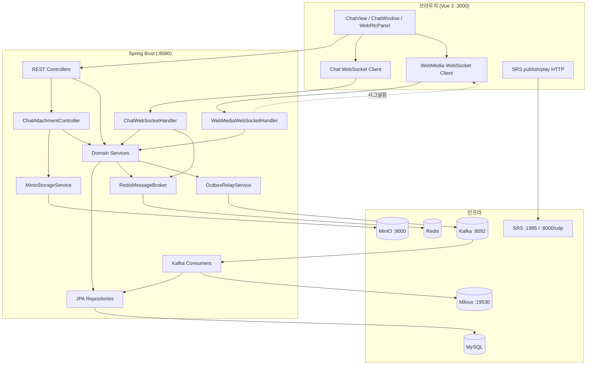
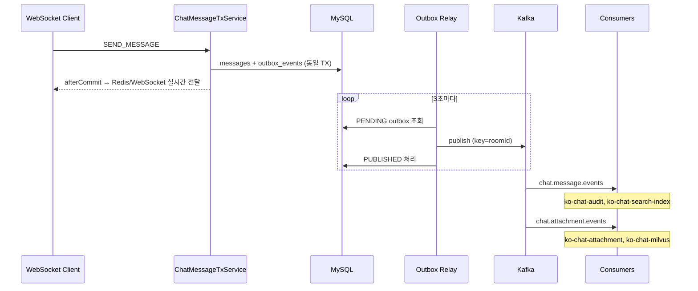
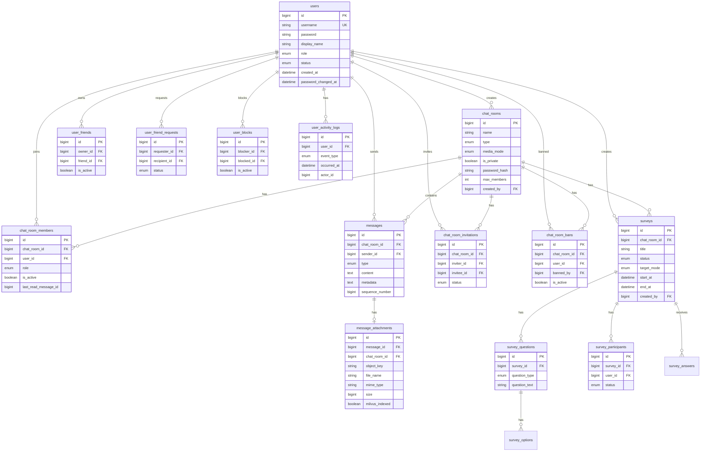
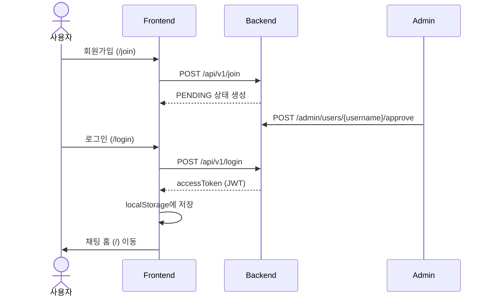
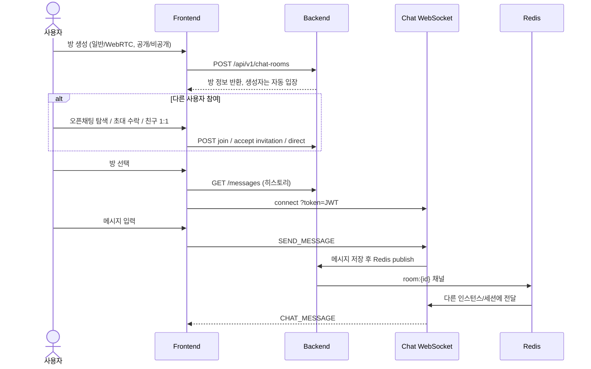
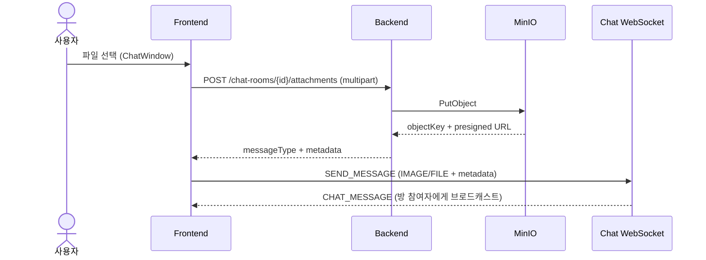
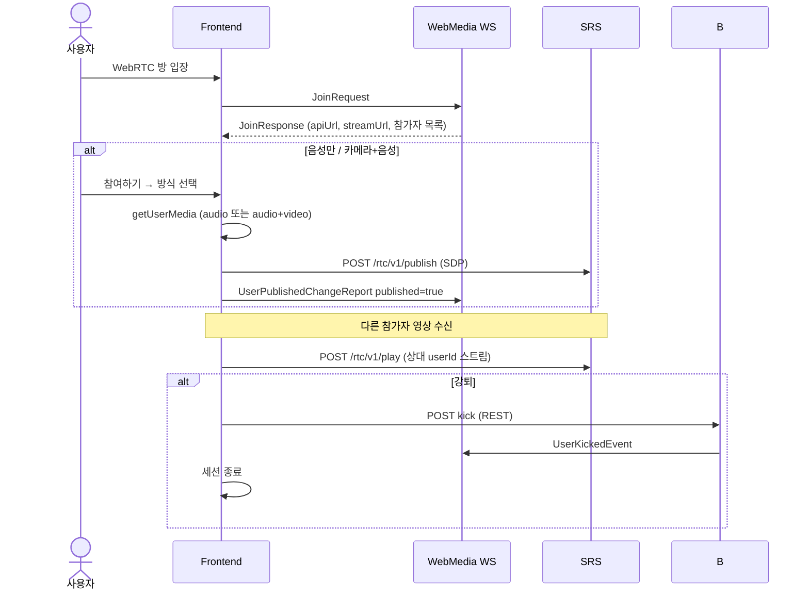

<br/>

# Ko_Chat — Kotlin/Spring 기반 채팅·화상 대화 프로젝트

Ko_Chat은 Kotlin + Spring Boot 백엔드와 Vue 3 프론트엔드로 만든 채팅 서비스입니다. <br/>
회원 승인, 친구/차단, 채팅방 관리, 설문조사, 관리자 통계(메시지·사용자 활동), 파일 첨부, WebRTC 화상 대화, Kafka 기반 후처리까지 한 흐름으로 묶어 구현했습니다.<br/>

---

## 목차

- [왜 만들었는가](#왜-만들었는가)
- [주요 기능](#주요-기능)
- [기술 스택](#기술-스택)
- [시스템 아키텍처](#시스템-아키텍처)
- [ERD](#erd)
- [프로젝트 흐름](#프로젝트-흐름)
- [디렉토리 구조](#디렉토리-구조)
- [실행 방법](#실행-방법)
- [환경 설정](#환경-설정)
- [API · WebSocket 요약](#api--websocket-요약)
- [Kafka 후처리 아키텍처](#kafka-후처리-아키텍처)
- [포트 정리](#포트-정리)
- [트러블슈팅](#트러블슈팅)

---

## 왜 만들었는가

채팅 기능은 겉으로 보면 메시지를 저장하고 보여주는 정도로 보이지만, 실제로는 인증, 관계, 방 권한, 실시간 전송, 파일 처리, 장애 대응이 같이 따라옵니다.<br/>

이 프로젝트는 그런 흐름을 한 번에 확인하기 위해 만들었습니다.<br/>
단순 CRUD 예제가 아니라, 사용자가 가입하고 승인된 뒤 친구를 추가하고, 방을 만들고, 메시지를 보내고, 파일을 첨부하고, 필요한 경우 화상 대화까지 이어지는 구조를 목표로 했습니다.
<br/><br/>

| 목표              | 구현 방향                                                       |
| ----------------- | --------------------------------------------------------------- |
| 헥사고날 아키텍처 | 도메인 규칙과 외부 어댑터를 분리                                |
| 실시간 채팅       | WebSocket + Redis Pub/Sub으로 메시지 브로드캐스트               |
| WebRTC 화상       | SRS 미디어 서버와 별도 시그널링 WebSocket 사용                  |
| 첨부파일·링크     | MinIO 객체 저장, 링크 미리보기, Milvus 인덱싱                   |
| 사용자 관리       | 가입 승인, 정지, 비밀번호 정책, 관리자 SSE                      |
| 관리자 기능       | 강제 퇴장, 통계, 사용자 활동 이력, Outbox/DLQ/consumer lag 확인 |
| Kafka 후처리      | 감사 로그, 검색 인덱스, 첨부파일 후처리 consumer 분리           |
| 친구·차단 흐름    | 친구 요청, 초대, 강퇴, 비공개 방, 차단 이력 처리                |

---

## 주요 기능

### 사용자 · 인증

- 회원가입 후 관리자 승인 필요, `PENDING` → `ACTIVE`
- JWT 기반 로그인
- 토큰 만료 검증 및 401 응답 시 자동 로그아웃·재로그인 유도
- 프로필 수정, 탈퇴, 비밀번호 변경 (30일 만료·실패 잠금 정책)
- 초기 관리자 계정 자동 생성

### 관리자

| 화면        | 경로                | 기능                                                                                  |
| ----------- | ------------------- | ------------------------------------------------------------------------------------- |
| 사용자 관리 | `/admin/users`      | 목록 조회, SSE 기반 실시간 갱신, 승인·정지·활성화·복구·잠금 해제·역할 변경·삭제       |
| 채팅방 관리 | `/admin/chat-rooms` | 활성 채팅방 목록, 멤버 조회, 강제 퇴장, 메시지 감사 조회                              |
| 통계        | `/admin/statistics` | 시간대별·메시지 유형별·채팅방 유형별·사용자 활동 집계, Chart.js 차트, Excel/PDF보내기 |
| 메시징 운영 | `/admin/messaging`  | Outbox·processed_events·DLQ·Kafka consumer lag 모니터링, FAILED 이벤트 재큐잉         |
| 설문조사    | `/admin/surveys`    | 설문 생성·게시·랜덤 배정·대상자 엑셀 업로드·통계(문항/참여자/채팅방별)·Excel/PDF      |

- 사용자 목록: 민감 정보 AES 암호화 payload
- 통계 필터: 검색기간, 채팅방 유형, 메시지 유형, 사용자 활동 유형
- 관리자 목록(친구 제외): 페이지네이션 공통 컴포넌트
- 관리자 화면 간 네비게이션: 채팅 · 사용자 관리 · 채팅방 관리 · 통계 · 설문조사 · 메시징 운영 · 내 정보

### 채팅

| 구분        | 내용                                                               |
| ----------- | ------------------------------------------------------------------ |
| 방 종류     | `DIRECT`(1:1), `GROUP`, `CHANNEL`                                  |
| 미디어 모드 | `일반 채팅`, `화상대화 2~6명`                                      |
| 공개 설정   | 공개 방 / 비공개 + 비밀번호                                        |
| 참여        | 초대 수락, 오픈채팅 탐색, 친구 목록 1:1, REST `POST .../members`   |
| 검색        | 참여 중인 방: 제목·설명·메시지 내용·상대 이름으로 검색             |
| 발견        | 공개 그룹/채널 탐색                                                |
| 관리        | 방 설정, 정원 변경, 강퇴·재입장 차단, 나가기                       |
| 실시간      | WebSocket 메시지 송수신, 읽음 처리, 시스템 메시지                  |
| 후처리      | Kafka 이벤트                                                       |
| 설문조사    | 방장/관리자 설문 생성·게시·응답·통계, 대상자 선택/랜덤/엑셀 업로드 |

### 메시지 · 첨부파일

| 타입     | 설명                          |
| -------- | ----------------------------- |
| `TEXT`   | 일반 텍스트                   |
| `IMAGE`  | 이미지 미리보기               |
| `FILE`   | 파일 카드 + 다운로드 링크     |
| `LINK`   | URL 링크 미리보기             |
| `SYSTEM` | 입장·퇴장·강퇴 등 시스템 알림 |

- 파일 업로드: `POST /chat-rooms/{id}/attachments` → MinIO 저장 → WebSocket `SEND_MESSAGE`로 전송
- 링크 미리보기: `POST /chat-rooms/link-preview`
- 첨부 메타데이터는 `messages.metadata` JSON 컬럼에 저장
- Milvus 인덱싱: Kafka `ko-chat-milvus` consumer가 비동기 처리

### WebRTC 화상

- 방 생성 시 일반 채팅 / WebRTC 화상 선택
- 참여 방식: 음성만 / 카메라+음성 / 시청 전용
- 마이크 음소거, 카메라 on/off, 화면 공유
- 강퇴·나가기 시 WebRTC 세션 연동 해제

### 친구 · 차단

- 친구 요청 / 수락 / 거절
- 사용자 차단 및 차단 이력
- 친구 목록에서 1:1 채팅 바로 시작
- 채팅 초대와 친구 요청 통합 알림 UI

### 프론트엔드 UI

메신저에서 흔히 쓰는 3단 레이아웃

| 영역          | 컴포넌트              | 역할                                      |
| ------------- | --------------------- | ----------------------------------------- |
| 좌측 내비     | `sleekydz86-nav-rail` | 친구 / 채팅 / 더보기 탭, 안읽음·요청 뱃지 |
| 목록 패널     | `FriendListPanel`     | 친구 검색·추가, 1:1 채팅                  |
|               | `ChatRoomList`        | 채팅 목록, 전체/안읽음 필터, 방 생성·검색 |
|               | `MorePanel`           | 프로필 이동, 차단 목록, 관리자 메뉴       |
| 관리자        | `AdminUsersView`      | 사용자 승인·정지·역할 관리                |
|               | `AdminChatRoomsView`  | 채팅방·멤버 조회, 강제 퇴장               |
|               | `AdminStatisticsView` | 통계 차트·표·엑셀/PDF                     |
|               | `AdminSurveysView`    | 관리자 설문 목록·생성·통계·엑셀 업로드    |
|               | `AdminMessagingView`  | Kafka Outbox/DLQ/lag 운영 대시보드        |
|               | `SurveyPanel`         | 채팅방 내 설문 생성·응답·통계             |
|               | `StatisticsBarChart`  | Chart.js 막대·누적 차트                   |
|               | `PaginationBar`       | 관리자·목록 공통 페이지네이션             |
|               | `OpenChatSearchPanel` | 오픈채팅·1:1 사용자 탐색                  |
| 메인 패널     | `ChatWindow`          | 말풍선 채팅, 멤버·설정, 파일 업로드       |
|               | `WebRtcPanel`         | WebRTC 화상                               |
| 메시지 렌더링 | `ChatMessageContent`  | TEXT/IMAGE/FILE/LINK 타입별 표시          |

---

## 기술 스택

### Backend

| 항목          | 기술                               |
| ------------- | ---------------------------------- |
| 언어          | Kotlin 2.2, Java 21                |
| 프레임워크    | Spring Boot 4.0, Spring Security 7 |
| DB            | MySQL                              |
| 캐시 · 메시징 | Redis                              |
| 이벤트 스트림 | Apache Kafka, Spring Kafka         |
| 객체 저장소   | MinIO                              |
| 벡터 DB       | Milvus                             |
| 인증          | JWT , BCrypt                       |
| API 문서      | springdoc-openapi                  |
| 실시간        | Spring WebSocket                   |
| 미디어        | SRS 5                              |
| 통계보내기    | Apache POI , OpenPDF               |

### Frontend

| 항목       | 기술                                                                                   |
| ---------- | -------------------------------------------------------------------------------------- |
| 프레임워크 | Vue 3                                                                                  |
| 빌드       | Vite 8, TypeScript 6                                                                   |
| 라우팅     | Vue Router 5                                                                           |
| 상태       | Composables                                                                            |
| HTTP       | `fetch` 래퍼                                                                           |
| 차트       | Chart.js 4                                                                             |
| 타입       | `types/chat/`, `types/user/`, `types/survey/`, `types/statistics/`, `types/messaging/` |

---

## 시스템 아키텍처

### 전체 구성



### 백엔드 아키텍처

```
com.kochat
├── domain/              # 도메인 모델, messaging 이벤트 타입
├── adapter/
│   ├── inbound/         # REST, WebSocket, Kafka Consumer
│   └── outbound/        # JPA, Redis, MinIO, Milvus, Outbox
└── global/              # Security, JWT, Outbox Relay, 애플리케이션 서비스
```

| 레이어                       | 역할                                           |
| ---------------------------- | ---------------------------------------------- |
| domain                       | 비즈니스 규칙, `ChatEventType`, 이벤트 payload |
| adapter/inbound              | REST·WebSocket·Kafka Consumer                  |
| adapter/outbound             | DB·Redis·MinIO·Milvus·Outbox                   |
| global/application/messaging | Outbox 저장, Relay, 멱등성 처리                |

### 실시간 채팅 vs WebRTC

|               | 일반 채팅               | WebRTC 화상            |
| ------------- | ----------------------- | ---------------------- |
| 시그널링      | `/api/v1/ws/chat`       | `/api/v1/ws/webmedia`  |
| 메시지·텍스트 | WebSocket + DB 저장     | 동일                   |
| 첨부파일      | MinIO + WebSocket       | 동일                   |
| 영상·음성     | 없음                    | SRS `publish` / `play` |
| 방 관리       | 초대·강퇴·비밀번호·설정 | 동일 API·UI            |

채팅 메시지는 백엔드 WebSocket + Redis로 처리합니다. <br/>
영상·음성 스트림은 SRS가 맡고, 백엔드는 시그널링과 방 상태만 관리합니다.<br/>

### 실시간 vs Kafka 후처리

| 구분          | 담당                      | 설명                                               |
| ------------- | ------------------------- | -------------------------------------------------- |
| 실시간 전달   | WebSocket + Redis Pub/Sub | 채팅 말풍선, 다중 인스턴스 브로드캐스트            |
| 후처리 이벤트 | Kafka                     | 감사 로그, 검색 인덱스, 첨부 후처리, Milvus 인덱싱 |

메시지 저장 트랜잭션 안에서 Outbox에 이벤트를 기록하고, 별도 Relay가 Kafka로 발행합니다. <br/>
Kafka가 잠깐 내려가도 이벤트는 DB에 남기 때문에 복구 후 다시 발행할 수 있습니다.



---

## ERD



### 주요 테이블 설명

| 테이블                                  | 설명                                                                      |
| --------------------------------------- | ------------------------------------------------------------------------- |
| `users`                                 | 계정, 역할, 상태                                                          |
| `chat_rooms`                            | 방 메타. `media_mode`: `TEXT` \| `WEBRTC`, `is_private` + `password_hash` |
| `chat_room_members`                     | 멤버십, 역할, 읽음 위치                                                   |
| `messages`                              | `TEXT`/`IMAGE`/`FILE`/`LINK`/`SYSTEM`, `metadata` JSON, 시퀀스 번호       |
| `message_attachments`                   | MinIO `object_key`, Milvus 인덱싱 여부                                    |
| `chat_room_invitations`                 | 초대·수락·거절                                                            |
| `chat_room_bans`                        | 강퇴 후 재입장 차단                                                       |
| `user_friends` / `user_friend_requests` | 친구 관계                                                                 |
| `user_blocks`                           | 차단                                                                      |
| `user_activity_logs`                    | 사용자 활동 이력 (가입·비밀번호변경·정지·탈퇴) — 통계 집계 원본           |
| `surveys` / `survey_questions` 등       | 설문조사, 문항, 선택지, 참여자, 응답                                      |

### 사용자 활동 통계

회원 lifecycle API 호출 시 `user_activity_logs`에 이벤트를 기록하고, 관리자 통계 API가 일자별로 집계합니다.

| 이벤트            | 설명          | 기록 시점                  |
| ----------------- | ------------- | -------------------------- |
| `JOIN`            | 가입          | 회원가입, 관리자 회원 등록 |
| `PASSWORD_CHANGE` | 비밀번호 변경 | 비밀번호 변경 API 성공 시  |
| `SUSPEND`         | 이용 정지     | 관리자 정지 처리           |
| `WITHDRAW`        | 탈퇴          | 본인·관리자 탈퇴 처리      |

앱 최초 기동 시 로그 테이블이 비어 있으면 기존 가입·비밀번호변경 이력을 백필합니다.

### 메시징 · Kafka 운영 테이블

| 테이블                    | 설명                          |
| ------------------------- | ----------------------------- |
| `outbox_events`           | Outbox 패턴 이벤트            |
| `processed_events`        | consumer 멱등성               |
| `dlq_events`              | DLQ 보관·재발행 이력          |
| `chat_audit_logs`         | `CHAT_MESSAGE_SENT` 감사 로그 |
| `message_search_index`    | 메시지 검색 인덱스            |
| `attachment_process_logs` | 첨부 후처리 완료 이력         |

---

## 프로젝트 흐름

### 1. 회원가입 · 로그인



### 2. 채팅방 생성 · 참여 · 메시지



### 3. 첨부파일 업로드



### 4. 화상대화방



### 5. 프론트엔드 화면 흐름

```
/login, /join              → 비로그인
/                          → ChatView
/welcome                   → 기능 허브
/profile                   → 프로필
/admin/users               → 관리자 · 사용자 관리
/admin/chat-rooms          → 관리자 · 채팅방 관리
/admin/statistics          → 관리자 · 통계 (메시지·사용자 활동)
/admin/surveys             → 관리자 · 설문조사
/admin/messaging           → 관리자 · 메시징 운영 (Kafka)
/error, /*                 → 에러 / 404 페이지
```

`ChatView` 내부 탭:

```
친구 탭   → FriendListPanel
채팅 탭   → ChatRoomList
더보기 탭 → MorePanel
```

---

## 디렉토리 구조

```
ko_chat/
├── README.md
├── docker-compose.srs.yml      # SRS WebRTC
├── backend/
│   ├── build.gradle.kts
│   └── src/main/kotlin/com/kochat/
│       ├── adapter/
│       │   ├── inbound/
│       │   │   ├── web/admin/          # 사용자·채팅방·통계·설문·메시징 REST
│       │   │   │   └── dto/            # 통계·설문 DTO
│       │   │   ├── web/chat/
│       │   │   ├── web/survey/         # 방 설문 REST + dto/
│       │   │   ├── kafka/consumer/     # audit, search-index, attachment, milvus, dlq
│       │   │   └── websocket/
│       │   └── outbound/
│       │       ├── persistence/
│       │       │   ├── chat/
│       │       │   ├── survey/
│       │       │   ├── user/           # users, user_activity_logs
│       │       │   ├── messaging/      # audit, search index, dlq, processed_events
│       │       │   └── outbox/
│       │       └── storage/
│       ├── domain/
│       │   ├── survey/model/           # SurveyStatus, QuestionType, TargetMode
│       │   └── user/model/             # UserActivityEventType
│       └── global/
│           ├── application/
│           │   ├── admin/              # 통계 조회·export, 설문 export
│           │   ├── chat/
│           │   ├── user/               # UserActivityLogService, lifecycle
│           │   └── messaging/          # Outbox, Relay, Lag monitor, DLQ replay
│           └── config/                 # KafkaProperties, KafkaTopicProperties, …
└── frontend/
    ├── package.json
    ├── vite.config.ts
    └── src/
        ├── api/                        # chatApi, surveyApi, statisticsApi, messagingApi
        ├── components/
        │   ├── StatisticsBarChart.vue, SurveyPanel.vue, PaginationBar.vue
        │   └── …
        ├── types/                      # chat/, user/, survey/, statistics/, messaging/
        ├── styles/                     # 컴포넌트·뷰별 외부 CSS
        ├── views/
        │   ├── AdminUsersView.vue, AdminChatRoomsView.vue
        │   ├── AdminStatisticsView.vue, AdminSurveysView.vue, AdminMessagingView.vue
        │   └── ChatView.vue, …
        └── router/
```

---

## 실행 방법

### 사전 요구사항

- Java 21
- Node.js
- MySQL `localhost:3306`, DB `kochat`
- Redis `localhost:9379`
- MinIO `localhost:9000`
- Milvus `localhost:19530`
- Kafka `localhost:9092`
- Docker — SRS

### 1. MySQL · Redis

`backend/src/main/resources/application.properties` 기준

```properties
spring.datasource.url=jdbc:mysql://localhost:3306/kochat?...
spring.datasource.username=kochat
spring.datasource.password=kochat
spring.data.redis.host=localhost
spring.data.redis.port=9379
```

DB·계정을 먼저 생성한 뒤 백엔드를 실행하세요.

### 2. MinIO

```powershell
docker run -d --name minio `
  -p 9000:9000 -p 9001:9001 `
  -e MINIO_ROOT_USER=minioadmin `
  -e MINIO_ROOT_PASSWORD=minioadmin `
  minio/minio server /data --console-address ":9001"
```

`application.properties` 기본값과 일치합니다.
텍스트 채팅만 확인할 때는 `app.minio.enabled=false`로 MinIO 연동을 끌 수 있습니다.

### 3. Milvus

Milvus Standalone을 로컬에 띄운 뒤 `app.milvus.host=localhost`, `app.milvus.port=19530`으로 연결합니다. <br/>
Milvus가 없어도 앱은 실행됩니다. 이 경우 첨부파일 벡터 등록만 건너뜁니다.<br/>

```properties
app.milvus.enabled=false   # Milvus 없이 실행하려면
```

### 4. Kafka

RAG Docker Compose에서 띄운 `rag-kafka` 컨테이너를 사용합니다.<br/>
호스트에서 Spring Boot가 붙으려면 advertised listener에 `localhost`가 포함되어야 합니다.

```yaml
KAFKA_CFG_LISTENERS: PLAINTEXT://:9092,PLAINTEXT_HOST://:29092,CONTROLLER://:9093
KAFKA_CFG_ADVERTISED_LISTENERS: PLAINTEXT://kafka:9092,PLAINTEXT_HOST://localhost:29092
KAFKA_CFG_LISTENER_SECURITY_PROTOCOL_MAP: CONTROLLER:PLAINTEXT,PLAINTEXT:PLAINTEXT,PLAINTEXT_HOST:PLAINTEXT
```

```properties
app.kafka.enabled=true
app.kafka.bootstrap-servers=localhost:29092
```

Kafka 없이 실행: `app.kafka.enabled=false`

### 5. SRS (WebRTC)

프로젝트 루트의 `docker-compose.srs.yml`로 SRS를 실행합니다.

```powershell
# 프로젝트 루트
docker compose -f docker-compose.srs.yml up -d
```

| 항목       | 내용            |
| ---------- | --------------- |
| 이미지     | `ossrs/srs:5`   |
| 컨테이너명 | `ko-chat-srs`   |
| 설정       | `conf/rtc.conf` |

| 포트     | 용도          |
| -------- | ------------- |
| 1985     | SRS HTTP API  |
| 8088     | SRS 내장 HTTP |
| 8000/udp | WebRTC 미디어 |

WebRTC publish/play는 **1985** 포트를 사용합니다.<br/>
NAT·원격 접속 시 호스트 IP를 `SRS_CANDIDATE`로 지정할 수 있습니다.<br/>

```powershell
# 예: LAN IP가 192.168.0.10인 경우
$env:SRS_CANDIDATE="192.168.0.10"
docker compose -f docker-compose.srs.yml up -d
```

`application.properties`의 `app.webmedia.api-url`·`app.webmedia.stream-url`이 SRS 주소와 일치하는지 확인하세요.

### 6. 백엔드

```powershell
cd backend
.\gradlew.bat bootRun
```

- API: http://localhost:8080
- Swagger: http://localhost:8080/swagger-ui.html
- Health: http://localhost:8080/actuator/health

### 7. 프론트엔드

```powershell
cd frontend
pnpm install   # 또는 pnpm install
pnpm run dev
```

- UI: http://localhost:3000
- `/api`, `/actuator`, WebSocket은 Vite가 `8080`으로 프록시
- SRS API는 `/srs` → `localhost:1985` 프록시

### 8. 최초 로그인

`application.properties` 기본값:

| 항목     | 값             |
| -------- | -------------- |
| 아이디   | `admin`        |
| 비밀번호 | `admin1234!@#` |

일반 사용자는 `/join` 가입 후 관리자 승인이 필요합니다.

---

## 환경 설정

### Backend

| 키                                   | 설명                          |
| ------------------------------------ | ----------------------------- |
| `jwt.secret`                         | JWT 서명 키                   |
| `jwt.access-token-expire-time`       | 토큰 만료                     |
| `app.admin.bootstrap.*`              | 시작 시 관리자 계정 생성      |
| `app.encryption.secret`              | 관리자 API 민감 데이터 AES 키 |
| `app.webmedia.api-url`               | SRS HTTP API                  |
| `app.webmedia.stream-url`            | WebRTC 스트림 URL             |
| `app.minio.enabled`                  | MinIO 사용 여부               |
| `app.minio.endpoint`                 | MinIO 엔드포인트              |
| `app.minio.access-key`               | MinIO 액세스 키               |
| `app.minio.secret-key`               | MinIO 시크릿 키               |
| `app.minio.bucket`                   | 버킷 이름                     |
| `app.milvus.enabled`                 | Milvus 사용 여부              |
| `app.milvus.host`                    | Milvus 호스트                 |
| `app.milvus.port`                    | Milvus 포트                   |
| `app.milvus.collection`              | 컬렉션 이름                   |
| `app.kafka.enabled`                  | Kafka 후처리 사용 여부        |
| `app.kafka.bootstrap-servers`        | Kafka broker 주소             |
| `app.kafka.topics.message-events`    | 메시지 이벤트 토픽            |
| `app.kafka.topics.attachment-events` | 첨부 이벤트 토픽              |
| `app.kafka.outbox-relay-interval-ms` | Outbox Relay 스케줄 간격      |
| `app.kafka.outbox-max-retries`       | Outbox 발행 최대 재시도       |
| `app.kafka.consumer-retry-attempts`  | Consumer 재시도 횟수          |
| `app.kafka.lag-warning-threshold`    | Lag 경고 임계값               |
| `app.kafka.lag-critical-threshold`   | Lag 위험 임계값               |
| `spring.servlet.multipart.*`         | 업로드 크기 제한              |

### Frontend

| 변수                     | 설명                         |
| ------------------------ | ---------------------------- |
| `VITE_API_BASE_URL`      | API 베이스                   |
| `VITE_ENCRYPTION_SECRET` | 관리자 사용자 목록 복호화 키 |

---

## Kafka 후처리 아키텍처

### 역할 분리

| 경로        | 기술                      | 용도                                               |
| ----------- | ------------------------- | -------------------------------------------------- |
| 실시간 전달 | WebSocket + Redis Pub/Sub | 채팅 말풍선, 멀티 인스턴스 동기화                  |
| 후처리      | Kafka + Outbox            | 감사 로그, 검색 인덱스, 첨부 후처리, Milvus 인덱싱 |

Kafka에는 메시지 원문이 아니라 이벤트만 발행합니다. <br/>
partition key는 `roomId`로 설정해 방 단위 순서를 유지합니다.

### 토픽

| 토픽                         | 이벤트                | Consumer                                |
| ---------------------------- | --------------------- | --------------------------------------- |
| `chat.message.events`        | `CHAT_MESSAGE_SENT`   | `ko-chat-audit`, `ko-chat-search-index` |
| `chat.attachment.events`     | `ATTACHMENT_UPLOADED` | `ko-chat-attachment`, `ko-chat-milvus`  |
| `chat.message.events.dlq`    | 실패 이벤트           | `ko-chat-dlq` → `dlq_events` 보관       |
| `chat.attachment.events.dlq` | 실패 이벤트           | `ko-chat-dlq` → `dlq_events` 보관       |
| `chat.outbox.events.dlq`     | Outbox 발행 실패      | 수동 재큐잉 (`/outbox/requeue-failed`)  |

---

## API · WebSocket 요약

### REST

| 영역            | 대표 경로                                                                                                 |
| --------------- | --------------------------------------------------------------------------------------------------------- |
| 인증            | `POST /login`, `POST /join`                                                                               |
| 사용자          | `GET /user/me`, `PUT /user/profile`, `GET /users/search`                                                  |
| 친구·차단       | `/users/friends`, `/users/friend-requests`, `/users/blocks`                                               |
| 채팅방          | `POST/GET /chat-rooms`, `POST /direct`, `PUT .../settings`, `POST .../kick`                               |
| 발견·참여       | `GET /chat-rooms/discover`, `/discover/recommended`, `/search`                                            |
| 메시지          | `GET /chat-rooms/{id}/messages`, `/messages/cursor`                                                       |
| 첨부            | `POST /chat-rooms/{id}/attachments`, `POST /chat-rooms/link-preview`, `GET /chat-rooms/files/url`         |
| 관리자 · 사용자 | `GET/POST /admin/users`, `GET /admin/users/stream`                                                        |
| 관리자 · 채팅방 | `GET /admin/chat-rooms`, `GET /{id}/members`, `POST /{id}/members/{userId}/kick`, `GET /{id}/messages`    |
| 관리자 · 통계   | `GET /admin/statistics/hourly`, `/message-types`, `/room-types`, `/users/daily`, 각 탭별 export           |
| 관리자 · 메시징 | `GET /admin/messaging/operations`, `POST /outbox/requeue-failed`, `POST /dlq/{id}/replay` (Kafka 활성 시) |
| 설문조사        | `GET/POST /chat-rooms/{roomId}/surveys`, `GET /admin/surveys`, 랜덤 배정·업로드·통계 export               |

#### 설문조사 API

| 엔드포인트                                                             | 설명                                                                         | 권한                    |
| ---------------------------------------------------------------------- | ---------------------------------------------------------------------------- | ----------------------- |
| `GET/POST/PUT/DELETE /chat-rooms/{roomId}/surveys`                     | 방 설문 CRUD·게시·종료·응답                                                  | 방장·관리자, 멤버(응답) |
| `GET /chat-rooms/{roomId}/surveys/{id}/statistics`                     | 문항별·참여자별 통계                                                         | 방장·관리자             |
| `POST /chat-rooms/{roomId}/surveys/{id}/participants/upload`           | 대상자 엑셀 업로드 (`username`/`userId`)                                     | 방장·관리자             |
| `GET /chat-rooms/{roomId}/surveys/{id}/statistics/export/{excel\|pdf}` | 통계보내기                                                                   | 방장·관리자             |
| `GET /admin/surveys`                                                   | 전체 설문 목록 (`status`, `chatRoomId`, `targetMode`, `title`, `from`, `to`) | 관리자                  |
| `POST /admin/surveys/rooms/{roomId}`                                   | 관리자 설문 생성                                                             | 관리자                  |
| `POST /admin/surveys/{id}/assign-random`                               | 랜덤 참여자 배정                                                             | 관리자                  |
| `POST /admin/surveys/{id}/participants/upload`                         | 대상자 엑셀 업로드                                                           | 관리자                  |
| `GET /admin/surveys/{id}/statistics`                                   | 설문 통계                                                                    | 관리자                  |
| `GET /admin/surveys/statistics/by-room`                                | 채팅방별 설문 통계                                                           | 관리자                  |

#### 관리자 통계 API

| 엔드포인트                                         | 설명                       | 주요 쿼리 파라미터                      |
| -------------------------------------------------- | -------------------------- | --------------------------------------- |
| `GET /admin/statistics/hourly`                     | 시간대 별 메시지 건수·비율 | `from`, `to`, `roomType`, `messageType` |
| `GET /admin/statistics/message-types`              | 메시지 유형별 년도별 집계  | `from`, `to`, `roomType`                |
| `GET /admin/statistics/room-types`                 | 채팅방 유형별 일자별 집계  | `from`, `to`, `messageType`             |
| `GET /admin/statistics/users/daily`                | 사용자 활동 일자별 집계    | `from`, `to`, `eventType`               |
| `GET /admin/statistics/users/daily/export/excel`   | 사용자 활동 Excel          | 동일 필터                               |
| `GET /admin/statistics/users/daily/export/pdf`     | 사용자 활동 PDF            | 동일 필터                               |
| `GET /admin/statistics/hourly/export/excel`        | 시간대별 Excel             | `from`, `to`, `roomType`, `messageType` |
| `GET /admin/statistics/hourly/export/pdf`          | 시간대별 PDF               | 동일 필터                               |
| `GET /admin/statistics/message-types/export/excel` | 메시지 유형별 Excel        | `from`, `to`, `roomType`                |
| `GET /admin/statistics/message-types/export/pdf`   | 메시지 유형별 PDF          | 동일 필터                               |
| `GET /admin/statistics/room-types/export/excel`    | 채팅방 유형별 Excel        | `from`, `to`, `messageType`             |
| `GET /admin/statistics/room-types/export/pdf`      | 채팅방 유형별 PDF          | 동일 필터                               |

#### 채팅방 검색·발견 파라미터

| API         | 주요 파라미터                                      |
| ----------- | -------------------------------------------------- |
| `/search`   | `q` — 참여 중인 방 제목·설명·메시지·상대 이름 검색 |
| `/discover` | `q`, `roomType` , `includePrivate`, `sort`         |

### WebSocket

| URL                                        | 용도            |
| ------------------------------------------ | --------------- |
| `ws://host/api/v1/ws/chat?token={JWT}`     | 실시간 채팅     |
| `ws://host/api/v1/ws/webmedia?token={JWT}` | WebRTC 시그널링 |

채팅 클라이언트 → 서버:

```json
{
  "type": "SEND_MESSAGE",
  "chatRoomId": 1,
  "messageType": "TEXT",
  "content": "안녕하세요"
}
```

첨부파일은 REST로 먼저 업로드하고, 이후 WebSocket 메시지에 `messageType`과 `metadata`를 함께 보냅니다.<br/>

WebMedia: `JoinRequest`, `UserPublishedChangeReport` 등 ([`WebMediaMessageType`](backend/src/main/kotlin/com/kochat/adapter/inbound/websocket/webmedia/WebMediaMessageType.kt))

---

## 포트 정리

| 서비스                | 포트     | 비고                      |
| --------------------- | -------- | ------------------------- |
| Frontend (Vite)       | 3000     | 개발 서버                 |
| Backend (Spring Boot) | 8080     | REST + WS                 |
| MySQL                 | 3306     |                           |
| Redis                 | 9379     | 캐시 + Pub/Sub            |
| MinIO API             | 9000     | 첨부파일 업로드           |
| MinIO Console         | 9001     | 웹 관리 콘솔              |
| Milvus                | 19530    | 첨부 벡터 인덱스          |
| Kafka (PLAINTEXT)     | 9092     | Docker 내부 / 단일 리스너 |
| Kafka (호스트)        | 29092    | `PLAINTEXT_HOST`          |
| SRS HTTP API          | 1985     | WebRTC 시그널링 HTTP      |
| SRS 내장 HTTP         | 8088     | 호스트 8088               |
| SRS WebRTC            | 8000/udp | 미디어                    |

---

## 트러블슈팅

| 증상                                     | 확인 사항                                                                                   |
| ---------------------------------------- | ------------------------------------------------------------------------------------------- |
| 채팅 메시지가 다른 탭/인스턴스에 안 보임 | Redis `localhost:9379` 실행 여부, `spring.data.redis.port` 일치                             |
| WebSocket 연결 실패                      | JWT 만료·401 — 재로그인; Vite 프록시로 `8080` 백엔드 기동 확인                              |
| Kafka consumer lag 증가                  | `/admin/messaging` lag 패널, broker 접속(`bootstrap-servers`), consumer group 상태          |
| Outbox `PENDING` 누적                    | Kafka broker 다운 여부; 복구 후 Relay(3초) 또는 `requeue-failed`                            |
| Outbox `FAILED`                          | `outbox-max-retries` 초과 — 원인 로그 확인 후 `requeue-failed`                              |
| DLQ 메시지 증가                          | `dlq_events` 테이블·consumer 로그; 수정 후 `replay` API                                     |
| Milvus 인덱싱 안 됨                      | `app.milvus.enabled`, `app.kafka.enabled`; `ko-chat-milvus` lag                             |
| 관리자 통계 차트 비어 있음               | 검색 기간·필터, 해당 기간 데이터 존재 여부; 사용자 활동 탭은 `user_activity_logs` 적재 확인 |
| SRS WebRTC 연결 실패                     | `docker compose -f docker-compose.srs.yml ps`, 1985/8000 포트, `SRS_CANDIDATE` IP 일치 여부 |
| `/admin/messaging` 404                   | `app.kafka.enabled=false` — API와 화면은 Kafka를 켰을 때만 제공                             |
| 첨부 업로드 실패                         | MinIO 실행·`app.minio.*` 설정, `multipart` 크기 제한                                        |

---

## 라이선스

학습 목적으로 만든 프로젝트입니다. 개선 의견이나 PR은 환영합니다.
