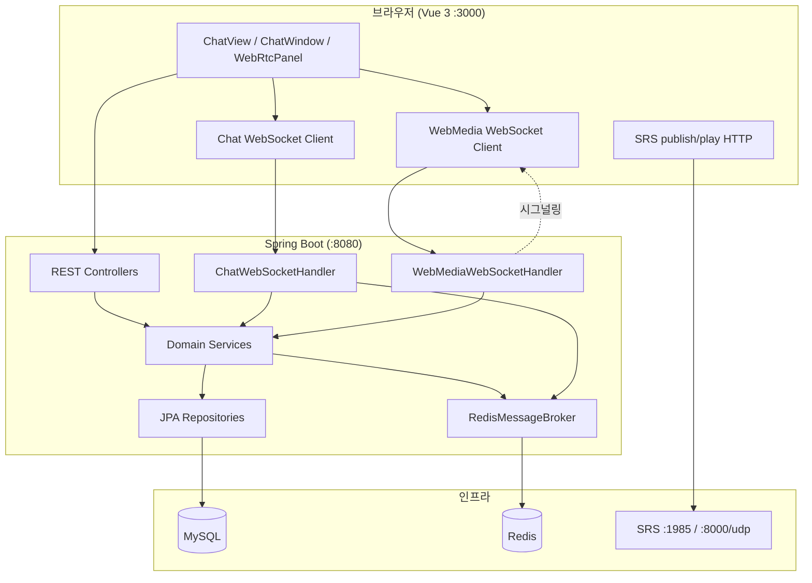
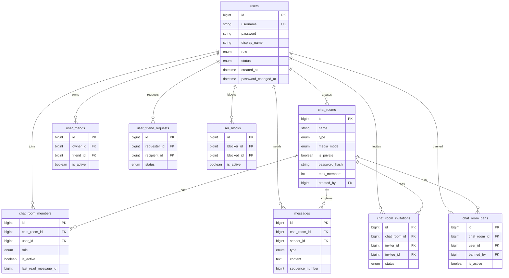
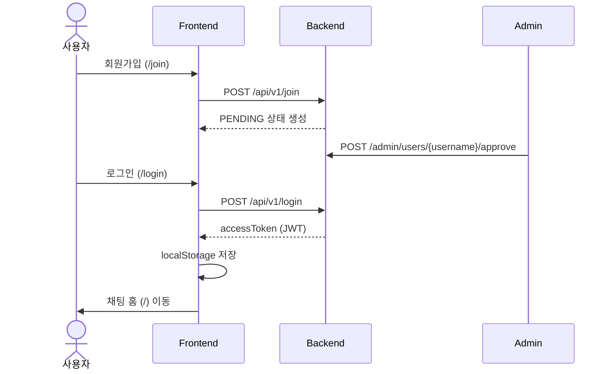
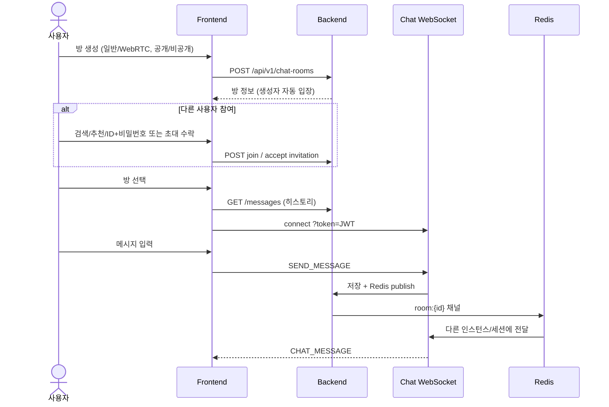
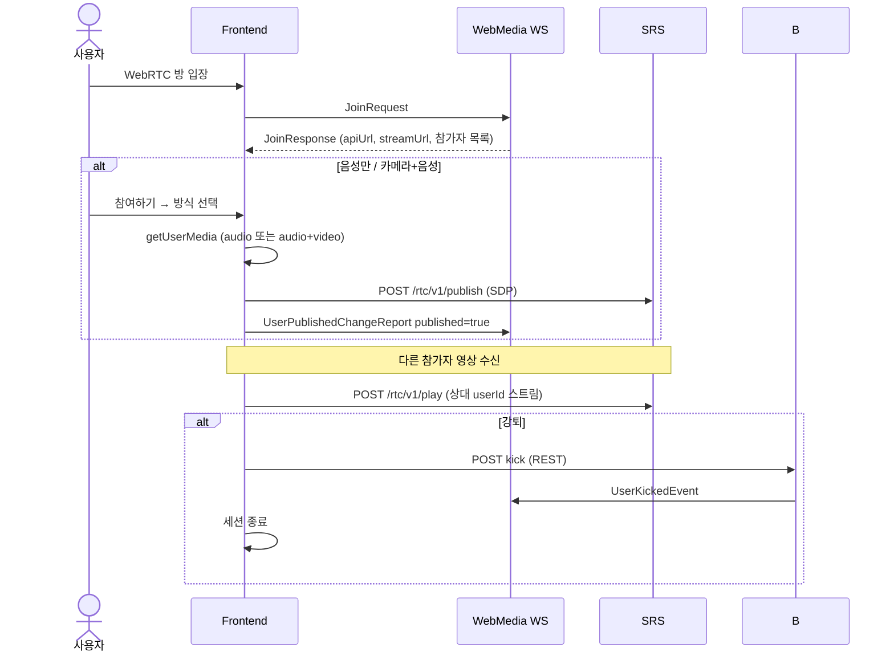

<br/>

# 코틀린기반의 채팅 Ko_Chat!

Kotlin + Spring Boot 백엔드와 Vue 3 프론트엔드로 구성된 **실시간 채팅·화상 통화** 학습/실습 프로젝트입니다.

---

## 목차

- [왜 만들었는가](#왜-만들었는가)
- [주요 기능](#주요-기능)
- [기술 스택](#기술-스택)
- [시스템 아키텍처](#시스템-아키텍처)
- [ERD](#erd)
- [프로젝트 흐름](#프로젝트-흐름)
- [디렉토리 구조](#디렉토리-구조)
- [실행 방법](#실행-방법)
- [환경 설정](#환경-설정)
- [API · WebSocket 요약](#api--websocket-요약)
- [포트 정리](#포트-정리)

---

## 왜 만들었는가

이 프로젝트는 **Kotlin/Spring 기반 실시간 서비스**를 end-to-end로 경험하기 위해 만들었습니다.

| 목표                       | 설명                                                     |
| -------------------------- | -------------------------------------------------------- |
| **헥사고날 아키텍처 실습** | 도메인·포트와 어댑터(REST, WebSocket, JPA) 분리          |
| **실시간 채팅**            | WebSocket + Redis Pub/Sub으로 다중 인스턴스 브로드캐스트 |
| **WebRTC 화상**            | SRS 미디어 서버 + 별도 시그널링 WebSocket                |
| **운영형 사용자 관리**     | 가입 승인, 정지, 비밀번호 정책, 관리자 SSE               |
| **소셜 + 채팅 통합**       | 친구·차단·초대·강퇴·비공개 방 등 실서비스에 가까운 흐름  |

단순 CRUD 데모가 아니라, **인증 → 관계 → 방 생성 → 실시간 메시지 → (선택) WebRTC**까지 한 앱 안에서 연결되도록 설계했습니다.

---

## 주요 기능

### 사용자 · 인증

- 회원가입 (가입 후 **관리자 승인** 필요, `PENDING` → `ACTIVE`)
- JWT 로그인 (Access Token, HS256)
- 프로필 수정, 탈퇴, 비밀번호 변경 (30일 만료·실패 잠금 정책)
- 부트스트랩 관리자 계정 자동 생성

### 관리자

- 사용자 목록 조회 (민감 정보 AES 암호화 payload)
- SSE 실시간 사용자 목록 스트림
- 승인 / 정지 / 활성화 / 복구 / 잠금 해제 / 역할 변경 / 삭제
- 채팅방 메시지 감사 조회

### 채팅

| 구분        | 내용                                              |
| ----------- | ------------------------------------------------- |
| 방 종류     | `DIRECT`(1:1), `GROUP`, `CHANNEL`                 |
| 미디어 모드 | `TEXT`(일반 채팅), `WEBRTC`(화상, 2~6명)          |
| 공개 설정   | 공개 방 / 비공개 + 비밀번호                       |
| 참여        | 초대, 검색·추천·ID로 직접 참여, 커서 페이징       |
| 관리        | 방 설정, 정원 변경, 강퇴·재입장 차단, 나가기      |
| 실시간      | WebSocket 메시지 송수신, 읽음 처리, 시스템 메시지 |

### WebRTC 화상

- 방 생성 시 **일반 채팅 / WebRTC 화상** 선택
- 참여 방식: **음성만** / **카메라+음성** / 시청 전용(송출 안 함)
- 마이크 음소거, 카메라 on/off, 화면 공유
- 강퇴·나가기 시 WebRTC 세션 연동 해제

### 친구 · 차단

- 친구 요청 / 수락 / 거절
- 사용자 차단 및 차단 이력
- 채팅 초대와 친구 요청 통합 UI

---

## 기술 스택

### Backend (`backend/`)

| 항목          | 기술                                     |
| ------------- | ---------------------------------------- |
| 언어          | Kotlin 2.2, Java 21                      |
| 프레임워크    | Spring Boot 4.0, Spring Security 7       |
| DB            | MySQL (JPA/Hibernate, `ddl-auto=update`) |
| 캐시 · 메시징 | Redis (캐시 + 채팅 Pub/Sub)              |
| 인증          | JWT (jjwt), BCrypt                       |
| API 문서      | springdoc-openapi (Swagger UI)           |
| 실시간        | Spring WebSocket                         |
| 미디어        | SRS 5 (`docker-compose.srs.yml`)         |

### Frontend (`frontend/`)

| 항목       | 기술                                          |
| ---------- | --------------------------------------------- |
| 프레임워크 | Vue 3 (Composition API)                       |
| 빌드       | Vite 8, TypeScript 6                          |
| 라우팅     | Vue Router 5                                  |
| 상태       | Composables (`ref` / composables, Pinia 없음) |
| HTTP       | `fetch` 래퍼 (`api/http.ts`)                  |

---

## 시스템 아키텍처

### 전체 구성



### 백엔드 아키텍처

```
com.kochat
├── domain/              # 도메인 모델, ChatService 인터페이스, 사용자 포트
├── adapter/
│   ├── inbound/         # REST, WebSocket, Security Filter
│   └── outbound/        # JPA, Redis, WebSocket Session
└── global/              # Security, JWT, 예외, 설정, 애플리케이션 서비스
```

| 레이어               | 역할                                          |
| -------------------- | --------------------------------------------- |
| **domain**           | 비즈니스 규칙, 엔티티 개념, 포트              |
| **adapter/inbound**  | HTTP·WebSocket 요청을 도메인 호출로 변환      |
| **adapter/outbound** | DB·Redis·외부 시스템 구현                     |
| **global**           | 횡단 관심사 (보안, 예외, OpenAPI, 부트스트랩) |

### 실시간 채팅 vs WebRTC

|               | 일반 채팅 (`TEXT`)      | WebRTC 화상 (`WEBRTC`) |
| ------------- | ----------------------- | ---------------------- |
| 시그널링      | `/api/v1/ws/chat`       | `/api/v1/ws/webmedia`  |
| 메시지·텍스트 | WebSocket + DB 저장     | 동일 (채팅 UI 공유)    |
| 영상·음성     | 없음                    | SRS `publish` / `play` |
| 방 관리       | 초대·강퇴·비밀번호·설정 | **동일 API·UI**        |

채팅 메시지는 **백엔드 WebSocket + Redis**로 처리하고, WebRTC **미디어 스트림만 SRS**가 중계합니다.

---

## ERD



### 주요 테이블 설명

| 테이블                                  | 설명                                                                      |
| --------------------------------------- | ------------------------------------------------------------------------- |
| `users`                                 | 계정, 역할(`ADMIN`/`USER`), 상태(`PENDING`/`ACTIVE`/…)                    |
| `chat_rooms`                            | 방 메타. `media_mode`: `TEXT` \| `WEBRTC`, `is_private` + `password_hash` |
| `chat_room_members`                     | 멤버십, 역할(`OWNER`/`ADMIN`/`MEMBER`), 읽음 위치                         |
| `messages`                              | `TEXT` / `SYSTEM` 메시지, 시퀀스 번호                                     |
| `chat_room_invitations`                 | 초대·수락·거절                                                            |
| `chat_room_bans`                        | 강퇴 후 재입장 차단                                                       |
| `user_friends` / `user_friend_requests` | 친구 관계                                                                 |
| `user_blocks`                           | 차단                                                                      |

---

## 프로젝트 흐름

### 1. 회원가입 · 로그인



### 2. 채팅방 생성 · 참여 · 메시지



### 3. WebRTC 화상 (WEBRTC 방)



### 4. 프론트엔드 화면 흐름

```
/login, /join          → 비로그인
/                      → ChatView (메인: 방 목록 + 채팅창)
/welcome               → 기능 허브
/profile               → 프로필
/admin/users           → 관리자 (ROLE_ADMIN)
/error, /*             → 에러 / 404 페이지
```

---

## 디렉토리 구조

```
ko_chat/
├── README.md                 # 이 문서
├── docker-compose.srs.yml    # SRS WebRTC 미디어 서버
├── backend/
│   ├── build.gradle.kts
│   └── src/main/kotlin/com/kochat/
│       ├── adapter/          # inbound(web, websocket) / outbound(persistence, redis)
│       ├── domain/           # chat, user 도메인
│       └── global/           # config, security, exception
└── frontend/
    ├── package.json
    ├── vite.config.ts
    └── src/
        ├── api/              # REST 클라이언트
        ├── components/       # ChatRoomList, ChatWindow, WebRtcPanel, …
        ├── composables/      # useAuth, useWebSocket, useWebMedia, …
        ├── views/            # 페이지 단위 뷰
        ├── lib/webmedia/     # SRS publish/play 클라이언트
        └── router/           # 라우팅·가드
```

---

## 실행 방법

### 사전 요구사항

- **Java 21**
- **Node.js** (Vite 8 호환)
- **MySQL** `localhost:3306`, DB `finsight`
- **Redis** `localhost:6379`
- (WebRTC 사용 시) **Docker** — SRS

### 1. MySQL · Redis

`backend/src/main/resources/application.properties` 기준:

```properties
spring.datasource.url=jdbc:mysql://localhost:3306/finsight?...
spring.datasource.username=finsight
spring.datasource.password=root123
spring.data.redis.host=localhost
spring.data.redis.port=6379
```

DB·계정을 먼저 생성한 뒤 백엔드를 실행하세요.

### 2. SRS (WebRTC 화상 시)

```powershell
# 프로젝트 루트
docker compose -f docker-compose.srs.yml up -d
```

| 포트     | 용도                        |
| -------- | --------------------------- |
| 1985     | SRS HTTP API (publish/play) |
| 8000/udp | WebRTC 미디어               |

> **주의:** SRS가 호스트 `8080`을 사용합니다. Spring Boot 기본 포트도 `8080`이므로 동시 실행 시 백엔드에 `server.port=8081` 등을 설정하거나 SRS 포트 매핑을 조정하세요.

### 3. 백엔드

```powershell
cd backend
.\gradlew.bat bootRun
```

- API: http://localhost:8080
- Swagger: http://localhost:8080/swagger-ui.html
- Health: http://localhost:8080/actuator/health

### 4. 프론트엔드

```powershell
cd frontend
npm install
npm run dev
```

- UI: http://localhost:3000
- `/api`, `/actuator`, WebSocket은 Vite가 `8080`으로 프록시
- SRS API는 `/srs` → `localhost:1985` 프록시

### 5. 최초 로그인 (부트스트랩 관리자)

`application.properties` 기본값:

| 항목     | 값             |
| -------- | -------------- |
| 아이디   | `admin`        |
| 비밀번호 | `admin1234!@#` |

일반 사용자는 `/join` 가입 후 관리자 승인이 필요합니다.

---

## 환경 설정

### Backend (`application.properties`)

| 키                             | 설명                                          |
| ------------------------------ | --------------------------------------------- |
| `jwt.secret`                   | JWT 서명 키                                   |
| `jwt.access-token-expire-time` | 토큰 만료 (ms, 기본 1시간)                    |
| `app.admin.bootstrap.*`        | 시작 시 관리자 계정 생성                      |
| `app.encryption.secret`        | 관리자 API 민감 데이터 AES 키                 |
| `app.webmedia.api-url`         | SRS HTTP API (기본 `http://localhost:1985`)   |
| `app.webmedia.stream-url`      | WebRTC 스트림 URL (기본 `webrtc://localhost`) |

### Frontend (`frontend/.env`)

| 변수                     | 설명                                                                 |
| ------------------------ | -------------------------------------------------------------------- |
| `VITE_API_BASE_URL`      | API 베이스 (비우면 상대 경로 + dev 프록시)                           |
| `VITE_ENCRYPTION_SECRET` | 관리자 사용자 목록 복호화 키 (백엔드 `app.encryption.secret`과 동일) |

---

## API · WebSocket 요약

### REST (prefix: `/api/v1`)

| 영역      | 대표 경로                                                      |
| --------- | -------------------------------------------------------------- |
| 인증      | `POST /login`, `POST /join`                                    |
| 사용자    | `GET /user/me`, `PUT /user/profile`, `GET /users/search`       |
| 친구·차단 | `/users/friends`, `/users/friend-requests`, `/users/blocks`    |
| 채팅방    | `POST/GET /chat-rooms`, `PUT .../settings`, `POST .../kick`    |
| 발견·참여 | `GET /chat-rooms/discover`, `/discover/recommended`, `/search` |
| 메시지    | `GET /chat-rooms/{id}/messages`, `/messages/cursor`            |
| 관리자    | `GET/POST /admin/users`, `GET /admin/users/stream` (SSE)       |

### WebSocket

| URL                                        | 용도            |
| ------------------------------------------ | --------------- |
| `ws://host/api/v1/ws/chat?token={JWT}`     | 실시간 채팅     |
| `ws://host/api/v1/ws/webmedia?token={JWT}` | WebRTC 시그널링 |

채팅 클라이언트 → 서버: `{ type: "SEND_MESSAGE", chatRoomId, messageType, content }`  
WebMedia: `JoinRequest`, `UserPublishedChangeReport` 등 ([`WebMediaMessageType`](backend/src/main/kotlin/com/kochat/adapter/inbound/websocket/webmedia/WebMediaMessageType.kt))

---

## 포트 정리

| 서비스                | 포트     | 비고                 |
| --------------------- | -------- | -------------------- |
| Frontend (Vite)       | 3000     | 개발 서버            |
| Backend (Spring Boot) | 8080     | REST + WS            |
| MySQL                 | 3306     |                      |
| Redis                 | 6379     | 캐시 + Pub/Sub       |
| SRS HTTP API          | 1985     | WebRTC 시그널링 HTTP |
| SRS WebRTC            | 8000/udp | 미디어               |

---

## 라이선스 · 기여

학습·실습용 프로젝트입니다. 이슈·PR은 자유롭게 활용해 주세요.
