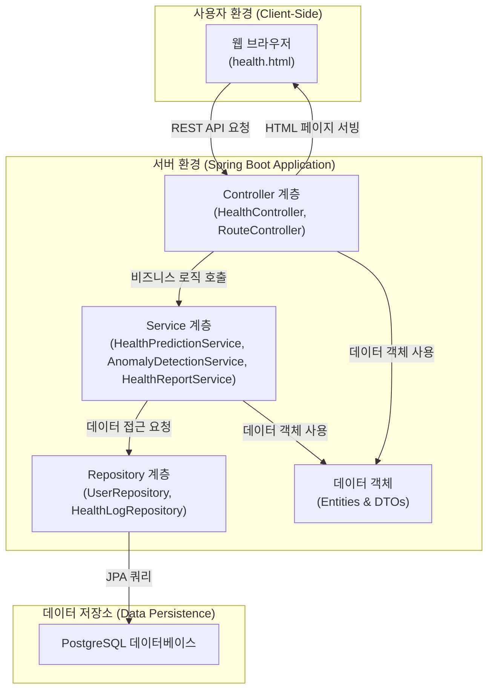

# 미니 건강 관리 프로젝트 (Ko-Mini-Health)

이 프로젝트는 사용자의 건강 데이터를 수집, 분석하고 리포트를 생성하는 간단한 웹 애플리케이션입니다. Spring Boot와 Kotlin을 사용하여 개발되었습니다.

## 주요 기능

- **사용자 정보 관리**: 사용자 ID, 이름, 신체 정보(키, 몸무게 등)를 저장합니다.
- **건강 데이터 로깅**: 수면 시간, 걸음 수, 스트레스 지수, 심박수 등 일일 건강 데이터를 기록합니다.
- **이상 징후 감지**: 심박수, 스트레스, 수면 부족 등 데이터에 기반하여 비정상적인 건강 신호를 감지하고 경고를 보냅니다.
- **건강 리스크 예측**: 축적된 데이터를 바탕으로 건강 위험도를 '높음', '보통', '낮음'으로 예측합니다.
- **건강 리포트 생성**: 선택한 기간(일간, 주간, 월간)에 대한 건강 데이터를 요약한 PDF 리포트를 생성하고 다운로드할 수 있습니다.
- **데이터 시각화**: 차트를 사용하여 기간별 건강 데이터의 변화 추이를 시각적으로 보여줍니다.

## 시스템 아키텍처

이 프로젝트는 계층형 아키텍처를 따릅니다.



- **사용자 환경 (Frontend)**: 사용자가 상호작용하는 웹 페이지입니다. 순수 HTML, CSS, JavaScript(Chart.js)로 구성되어 있습니다.
- **서버 환경 (Backend)**:
  - **Controller 계층**: 클라이언트의 HTTP 요청을 받아 해당 비즈니스 로직으로 라우팅합니다. (`HealthController`, `RouteController`)
  - **Service 계층**: 핵심 비즈니스 로직을 처리합니다. 이상 징후 감지, 리스크 예측, 리포트 생성 등의 기능이 여기에 포함됩니다. (`AnomalyDetectionService`, `HealthPredictionService`, `HealthReportService`)
  - **Repository 계층**: 데이터베이스와의 상호작용을 담당합니다. Spring Data JPA를 사용하여 데이터 접근을 단순화합니다. (`UserRepository`, `HealthLogRepository`)
  - **데이터 객체**: 데이터베이스 테이블과 매핑되는 `Entity`와 계층 간 데이터 전송을 위한 `DTO` 객체를 정의합니다.
- **데이터 저장소**: PostgreSQL 데이터베이스를 사용하여 사용자 및 건강 데이터를 영구적으로 저장합니다.

## 사용된 기술

- **Backend**: Spring Boot 3.x, Kotlin, Spring Data JPA
- **Database**: PostgreSQL
- **Frontend**: HTML, CSS, JavaScript
- **Libraries**:
  - iTextPDF: PDF 리포트 생성을 위해 사용됩니다.
  - Chart.js: 데이터 시각화를 위해 사용됩니다.
  - Spring AI (Onnx Transformer): `application.yml`에 설정되어 있으며, 향후 텍스트 기반 AI 기능 확장을 위해 포함될 수 있습니다.
- **Build Tool**: Gradle

## 실행 방법

### 사전 요구사항

- Java 17 이상
- Gradle 8.x
- PostgreSQL 데이터베이스

### 설정 및 실행

1.  **데이터베이스 설정**:

    - PostgreSQL을 설치하고 실행합니다.
    - `msword`라는 이름의 데이터베이스를 생성합니다.
    - `src/main/resources/application.yml` 파일을 열어 자신의 PostgreSQL 사용자 이름과 비밀번호에 맞게 `datasource` 정보를 수정합니다.

    ```yaml
    spring:
      datasource:
        url: jdbc:postgresql://localhost:5432/msword
        username: YOUR_USERNAME # 여기에 PostgreSQL 사용자 이름 입력
        password: YOUR_PASSWORD # 여기에 PostgreSQL 비밀번호 입력
    ```

2.  **애플리케이션 빌드 및 실행**:

    - 프로젝트 루트 디렉토리에서 터미널을 엽니다.
    - 아래 명령어를 실행하여 애플리케이션을 시작합니다.

    ```bash
    ./gradlew bootRun
    ```

3.  **애플리케이션 접속**:
    - 웹 브라우저를 열고 `http://localhost:8080/health` 로 접속합니다.

## API 엔드포인트

- `GET /health`: 메인 건강 대시보드 페이지를 반환합니다.
- `POST /health/user`: 신규 사용자 정보를 저장하거나 기존 사용자 정보를 업데이트합니다.
  - **Body**: `{"userId": "...", "userNm": "...", "height": "...", "weight": "...", "gender": "...", "bloodType": "..."}`
- `POST /health/log`: 사용자의 건강 데이터를 저장합니다.
  - **Body**: `{"userId": "...", "sleepHours": ..., "steps": ..., "stressLevel": ..., "heartRate": ...}`
- `GET /health/report`: 특정 사용자의 건강 리포트를 생성합니다.
  - **Query Parameters**:
    - `userId` (필수): 리포트를 생성할 사용자 ID
    - `period` (필수): 리포트 기간 (`daily`, `weekly`, `monthly`)
    - `maxDays` (선택): `period`가 `weekly`일 때, 조회할 최대 일수 (기본값: 7)
