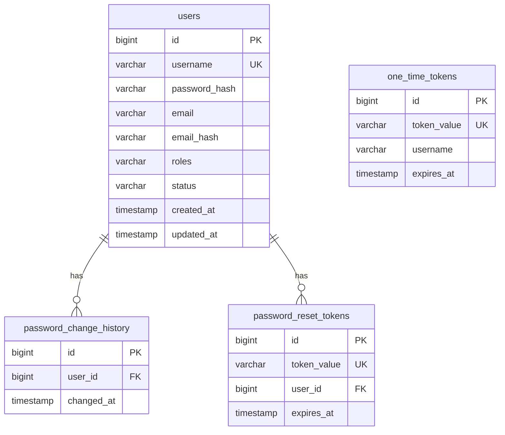
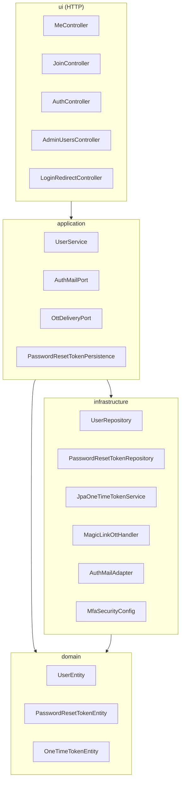
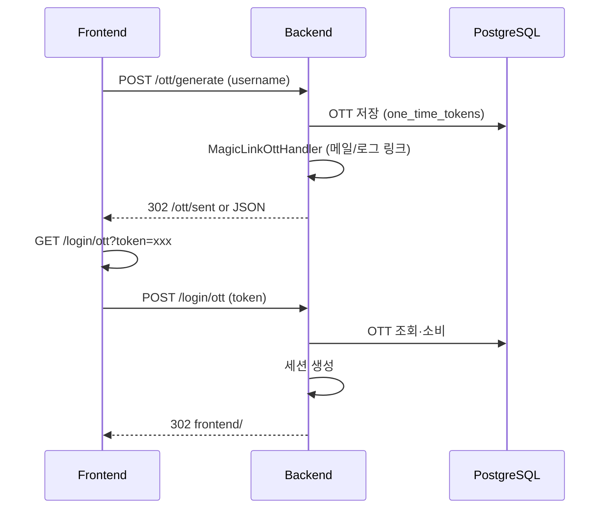
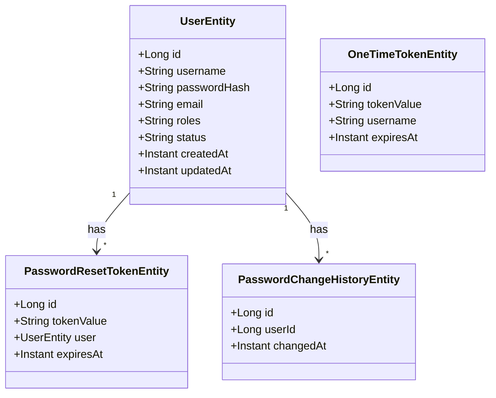

# Komfa
<br/>

## 실행화면

<br/>
## 메일발송 화면


<br/>

**Ko**tlin + **M**ulti-**F**actor **A**uthentication 기반 회원·인증·관리자 기능을 제공하는 풀스택 웹 프로젝트입니다.

- **Backend**: Kotlin, Spring Boot 7, Spring Security (Form Login + OTT), JPA, PostgreSQL
- **Frontend**: Svelte 5, Vite, TypeScript

회원가입·로그인(비밀번호 + 매직 링크 OTT), 아이디/비밀번호 찾기, 비밀번호 재설정, 마이페이지, 관리자 회원 관리(승인/정지/탈퇴/역할 변경) 등을 지원합니다.

---

## 1. 프로젝트 소개

### 1.1 주요 기능

| 구분   | 기능                                                                                                       |
| ------ | ---------------------------------------------------------------------------------------------------------- |
| 인증   | Form 로그인, One-Time Token(OTT) 매직 링크 로그인                                                          |
| 회원   | 회원가입, 로그인, 로그아웃, 마이페이지(프로필/비밀번호 변경), 탈퇴                                         |
| 복구   | 아이디 찾기(이메일), 비밀번호 찾기(재설정 링크 발송)                                                       |
| 관리자 | 회원 목록(검색/페이징), 승인/정지/탈퇴, 역할 변경(ROLE_USER/ROLE_ADMIN), 이메일 복호화, 비밀번호 변경 이력 |

### 1.2 기술 스택

- **Backend**: Kotlin 2.x, Spring Boot 7, Spring Security 7 (formLogin + oneTimeTokenLogin), Spring Data JPA, PostgreSQL, HikariCP
- **Frontend**: Svelte 5, Vite, TypeScript
- **기타**: AES256 이메일 암호화, SHA-256 이메일 해시, 메일 발송(선택)

---

## 2. 패키지 구조

### 2.1 Backend (`backend/src/main/kotlin/com/sleekydz86/komfa/`)

```
com.sleekydz86.komfa
├── KomfaApplication.kt                 # 진입점
├── domain/                             # 도메인 모델·값 객체
│   ├── auth/
│   │   ├── TokenValue.kt
│   │   ├── Username.kt
│   │   └── OttDeliveryResult.kt
│   ├── user/
│   │   ├── UserEntity.kt
│   │   ├── UserStatus.kt
│   │   ├── UserRole.kt
│   │   ├── PasswordResetTokenEntity.kt
│   │   ├── PasswordChangeHistoryEntity.kt
│   │   ├── *DTO.kt (UserRequest, FindUsername, ForgotPassword, ResetPassword, ChangePassword, UserProfileUpdate)
│   │   ├── JoinRejectedException.kt
│   │   └── WithdrawnAccountException.kt
│   └── ott/
│       └── OneTimeTokenEntity.kt
├── application/                        # 유스케이스·포트(인터페이스)
│   ├── user/
│   │   ├── UserService.kt
│   │   ├── AuthMailPort.kt
│   │   └── PasswordResetTokenPersistence.kt
│   └── auth/
│       ├── RequestOttCommand.kt
│       └── OttDeliveryPort.kt
├── infrastructure/                     # 외부 연동·구현체
│   ├── persistence/
│   │   ├── UserRepository.kt
│   │   ├── PasswordResetTokenRepository.kt
│   │   ├── PasswordChangeHistoryRepository.kt
│   │   ├── OneTimeTokenRepository.kt
│   │   └── DataInitializer.kt
│   ├── security/
│   │   ├── MfaSecurityConfig.kt
│   │   ├── MfaAuthorizationConfig.kt
│   │   ├── JpaUserDetailsService.kt
│   │   ├── Http401AuthenticationEntryPoint.kt
│   │   ├── GetMeNoErrorFilter.kt
│   │   └── SecurityBeans.kt
│   ├── ott/
│   │   ├── JpaOneTimeTokenService.kt
│   │   ├── MagicLinkOttHandler.kt
│   │   ├── MailOttDeliveryAdapter.kt
│   │   └── LoggingOttDeliveryAdapter.kt
│   ├── crypto/
│   │   ├── Aes256Service.kt
│   │   └── EmailHashService.kt (sha256Hex 등)
│   └── mail/
│       └── AuthMailAdapter.kt
└── ui/                                 # HTTP API·리다이렉트
    ├── MeController.kt
    ├── JoinController.kt
    ├── AuthController.kt
    ├── HealthController.kt
    ├── AdminUsersController.kt
    ├── AdminController.kt
    ├── UserController.kt
    ├── OttSentController.kt
    ├── LoginRedirectController.kt      # /login, /login/ott, /reset-password → frontend 리다이렉트
    └── dto/
        ├── MeResponse.kt
        ├── JoinErrorResponse.kt
        ├── AdminUserListItem.kt
        ├── AdminUserListResponse.kt
        ├── AdminPasswordHistoryResponse.kt
        └── PasswordHistoryItem.kt
```

### 2.2 Frontend (`frontend/src/`)

```
src/
├── main.ts
├── App.svelte
├── App.css
├── domain/                             # 도메인 타입
│   └── auth/
│       └── types.ts                   # Username 등
├── application/                       # 유스케이스·비즈니스 흐름
│   └── auth/
│       ├── health.ts
│       └── requestOtt.ts
├── infrastructure/                     # HTTP·외부 연동
│   └── http/
│       ├── api.ts                     # API 베이스·me·join·auth·admin 등
│       └── authApi.ts                 # OTT 요청·health
├── ui/                                # 화면·스타일
│   ├── svelte/
│   │   ├── Login.svelte
│   │   ├── LoginOtt.svelte
│   │   ├── Join.svelte
│   │   ├── Home.svelte
│   │   ├── Me.svelte
│   │   ├── User.svelte                # 회원 전용 + 관리자 회원 목록/관리
│   │   ├── OttSent.svelte
│   │   ├── FindUsername.svelte
│   │   ├── ForgotPassword.svelte
│   │   └── ResetPassword.svelte
│   ├── css/
│   │   ├── Login.css, Join.css, Home.css, Me.css, User.css, ...
│   │   └── Admin.css (legacy/참고)
│   └── ts/
│       ├── Admin.ts                   # statusLabel 등
│       ├── Login.types.ts
│       └── OttSent.types.ts
└── vite-env.d.ts
```

---

## 3. ERD (Entity Relationship Diagram)

PostgreSQL 스키마 기준 엔티티 관계입니다.



- **users**: 회원 한 명당 한 행. `roles`(예: ROLE_USER, ROLE_ADMIN), `status`(PENDING, ACTIVE, SUSPENDED, WITHDRAWN).
- **password_change_history**: 비밀번호 변경 시점 기록. `user_id` → `users.id`.
- **password_reset_tokens**: 비밀번호 재설정 링크용 일회성 토큰. `user_id` → `users.id`, `expires_at` 만료 후 삭제.
- **one_time_tokens**: OTT 매직 링크용 토큰. `username`으로 발급·소비 후 삭제.

---

## 4. UML (구성 요소·흐름)

### 4.1 Backend 레이어 개요



### 4.2 인증·OTT 흐름



### 4.3 회원·관리자 도메인 관계 (단순 클래스 다이어그램)



---
