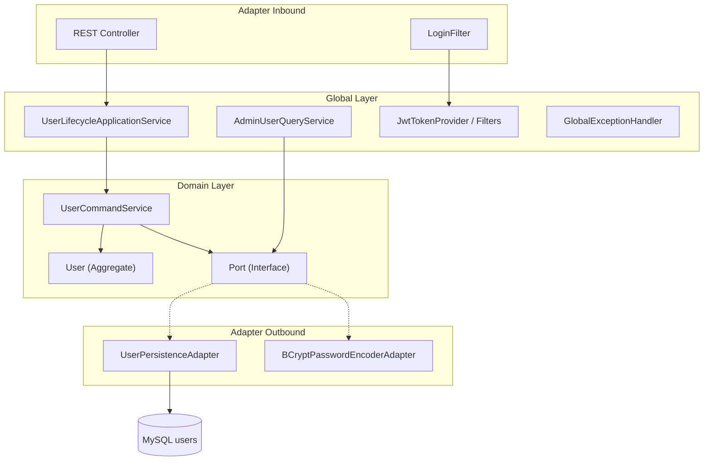
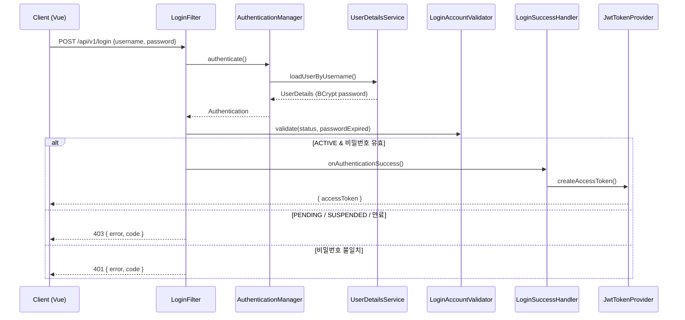
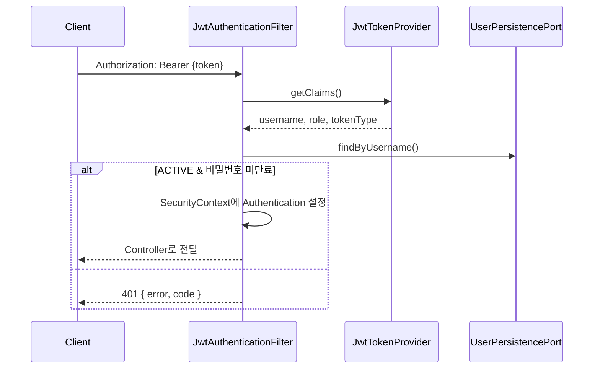
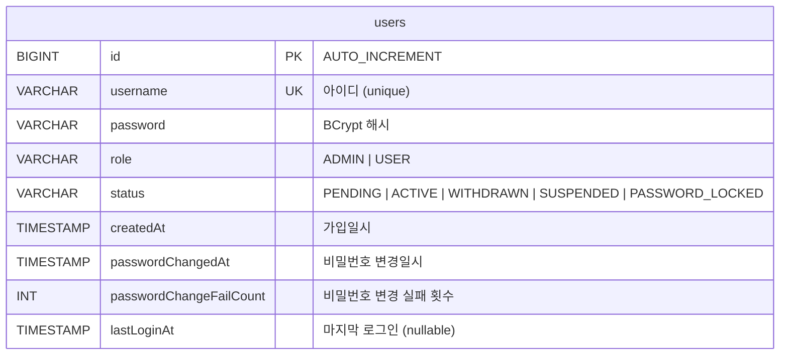

<br/>

# OAuth2 SSO Demo

Spring Boot 4 · Spring Security 7 · Kotlin 기반 JWT 인증/인가 데모 프로젝트입니다.  
회원 가입 → 관리자 승인 → JWT 로그인 → Role 기반 API 접근 → 관리자 회원 관리 흐름을 구현했습니다.

| 모듈 | 기술 스택 | 포트 |
|------|-----------|------|
| `authorization/` | Spring Boot 4.0, Spring Security 7.0.6, Kotlin 2.2, JPA, MySQL, JWT(HS256) | 8080 |
| `front/` | Vue 3, TypeScript, Vite, vue-router | 3000 |

---

## 목차

1. [왜 이렇게 구성했는가](#1-왜-이렇게-구성했는가)
2. [아키텍처](#2-아키텍처)
3. [인증/인가 흐름](#3-인증인가-흐름)
4. [ERD](#4-erd)
5. [테이블 명세서](#5-테이블-명세서)
6. [API 개요](#6-api-개요)
7. [실행 방법](#7-실행-방법)
8. [테스트](#8-테스트)
9. [Spring Security 7 + Kotlin 배운점](#9-spring-security-7--kotlin-배운점)

---

## 1. 왜 이렇게 구성했는가

### 1.1 아키텍처

| 레이어 | 패키지 | 역할 | 이유 |
|--------|--------|------|------|
| **Domain** | `domain/` | 회원 CUD, 상태 전이, 비즈니스 규칙 | 프레임워크(JPA, Security)에 의존하지 않는 순수 도메인 유지 |
| **Adapter Inbound** | `adapter/inbound/` | REST Controller, LoginFilter | HTTP·Security 진입점만 담당 |
| **Adapter Outbound** | `adapter/outbound/` | JPA, BCrypt | DB·외부 기술 구현체를 Port 뒤에 숨김 |
| **Global** | `global/` | Query, Security, Exception, Config | 조회·인프라·횡단 관심사 분리 |

**CUD는 Domain, Query는 Global**로 나눈 이유는 CQRS에 가까운 책임 분리를 적용하기 위함입니다.  
회원 상태 변경(승인, 정지, 탈퇴)은 도메인 규칙이 많지만, 관리자 목록 조회·암호화·SSE는 애플리케이션/인프라 성격이 강합니다.

### 1.2 JWT + Stateless

- 세션 대신 **JWT(HS256)** 를 사용해 SPA(Vue)와 분리된 백엔드 API 구조를 만들었습니다.
- `SessionCreationPolicy.STATELESS`로 서버 메모리에 세션을 두지 않습니다.
- OAuth2 Authorization Server 전체를 붙이기 전, **Security Filter Chain + JWT** 동작 원리를 먼저 익히기 위한 단계적 학습용 선택입니다.

### 1.3 회원 상태(PENDING → ACTIVE) + 관리자 승인

실무 SSO/회원 시스템에서 흔한 **가입 후 승인** 패턴을 반영했습니다.

```
PENDING → (관리자 승인) → ACTIVE
ACTIVE  → SUSPENDED / WITHDRAWN / PASSWORD_LOCKED
```

로그인 가능 여부는 `User.canLogin()`과 `LoginAccountValidator`에서 이중으로 검증합니다.

### 1.4 민감 정보 AES-256 암호화

관리자 사용자 목록 API는 **username만 평문**, 나머지(권한·상태·날짜 등)는 `encryptedPayload`(AES-256-GCM)로 내려줍니다.  
프론트에서는 **더블클릭** 시 Web Crypto API로 복호화합니다. (데모/학습용 — 운영 환경에서는 키 관리 방식 재검토 필요)

### 1.5 global 패키지 예외 처리

모든 API 오류는 `{ error, code }` 형식(`ApiErrorResponse`)으로 통일했습니다.

- `@RestControllerAdvice` → Controller/Service 예외
- `RestAuthenticationEntryPoint` / `RestAccessDeniedHandler` → Security 401/403
- `LoginAuthenticationFailureHandler` → 로그인 실패
- `ErrorResponseWriter` → Filter(JWT, Login) JSON 응답

메시지는 **전부 한국어**로 통일했습니다.

---

## 2. 아키텍처

### 2.1 패키지 구조

```
oauth2-sso-demo/
├── authorization/                    # 백엔드 (Spring Boot)
│   └── src/main/kotlin/com/sleekydz86/oauth/
│       ├── domain/user/              # 도메인 (CUD, 모델, Port, Exception)
│       │   ├── model/                # User, UserStatus, Command
│       │   ├── service/              # UserCommandService
│       │   ├── port/out/           # UserPersistencePort, PasswordEncoderPort
│       │   └── exception/
│       ├── adapter/
│       │   ├── inbound/
│       │   │   ├── web/              # Controller, DTO
│       │   │   └── security/         # LoginFilter
│       │   └── outbound/
│       │       ├── persistence/      # JPA Entity, Repository, Adapter
│       │       └── security/         # BCrypt Adapter
│       └── global/
│           ├── application/user/     # Query, Lifecycle, SSE
│           ├── security/             # JWT, Login Handler, EntryPoint
│           ├── exception/            # GlobalExceptionHandler, ErrorCode
│           ├── crypto/               # AesEncryptionService
│           ├── config/               # Security, OpenAPI, Bootstrap
│           ├── event/                # UserChangedEvent (SSE 트리거)
│           └── aop/                  # LoggingAspect
│
└── front/                            # 프론트 (Vue 3)
    └── src/
        ├── views/                    # Login, Home, AdminUsers
        ├── composables/              # useAuth, useAdminUsers
        ├── api/                      # authApi, adminApi
        └── utils/crypto.ts           # AES 복호화, JWT role 파싱
```

### 2.2 의존성 방향



**규칙:** Domain은 Adapter/Global을 모릅니다. Adapter는 Domain Port를 구현합니다.

### 2.3 파일 1타입 1파일

Kotlin 관례에 맞게 Command, Exception, DTO를 파일별로 분리했습니다.  
예: `JoinCommand.kt`, `DuplicateUsernameException.kt`, `ApproveUserRequest.kt`

---

## 3. 인증/인가 흐름

### 3.1 로그인 (JWT 발급)



### 3.2 API 요청 (JWT 검증)



### 3.3 Security Filter Chain 순서

```
SecurityContextHolderFilter
  → JwtAuthenticationFilter        (Bearer 토큰 검증)
  → LoginFilter                    (POST /api/v1/login 전용)
  → UsernamePasswordAuthenticationFilter
  → ... (authorizeHttpRequests)
```

### 3.4 Role 기반 URL 접근

| URL 패턴 | 권한 |
|----------|------|
| `/api/v1/join`, `/api/v1/login`, `/api/v1/user/password/change`, `/api/v1/` | permitAll |
| `/swagger-ui/**`, `/v3/api-docs/**` | permitAll |
| `/api/v1/admin/**` | ROLE_ADMIN |
| `/api/v1/user/**` | ROLE_USER 또는 ROLE_ADMIN |

---

## 4. ERD



현재 단일 테이블(`users`) 구조입니다. SSO 확장 시 `oauth_client`, `refresh_token` 등 테이블 추가를 고려할 수 있습니다.

---

## 5. 테이블 명세서

### 5.1 `users`

| 컬럼명 | 타입 | NULL | 키 | 기본값 | 설명 |
|--------|------|------|-----|--------|------|
| `id` | BIGINT | N | PK | AUTO_INCREMENT | 회원 고유 ID |
| `username` | VARCHAR(255) | N | UK | — | 로그인 아이디 (중복 불가) |
| `password` | VARCHAR(255) | N | — | — | BCrypt 인코딩된 비밀번호 |
| `role` | VARCHAR(50) | N | — | — | 권한: `ADMIN`, `USER` |
| `status` | VARCHAR(50) | N | — | — | 회원 상태 (아래 enum 참고) |
| `createdAt` | TIMESTAMP(6) | N | — | — | 가입 일시 (UTC Instant) |
| `passwordChangedAt` | TIMESTAMP(6) | N | — | — | 마지막 비밀번호 변경 일시 |
| `passwordChangeFailCount` | INT | N | — | 0 | 비밀번호 변경 실패 누적 (3회 시 잠금) |
| `lastLoginAt` | TIMESTAMP(6) | Y | — | NULL | 마지막 로그인 일시 |

### 5.2 `role` enum

| 값 | 설명 |
|----|------|
| `ADMIN` | 관리자 — `/api/v1/admin/**` 접근 가능 |
| `USER` | 일반 사용자 |

### 5.3 `status` enum

| 값 | 설명 | 로그인 |
|----|------|--------|
| `PENDING` | 가입 후 관리자 승인 대기 | 불가 |
| `ACTIVE` | 정상 이용 | 가능 |
| `WITHDRAWN` | 탈퇴 (soft delete) | 불가 |
| `SUSPENDED` | 관리자 이용 정지 | 불가 |
| `PASSWORD_LOCKED` | 비밀번호 변경 3회 실패 잠금 | 불가 |

### 5.4 도메인 비즈니스 규칙

| 규칙 | 상수/조건 |
|------|-----------|
| 비밀번호 유효 기간 | 30일 (`User.PASSWORD_VALID_DAYS`) |
| 비밀번호 변경 실패 잠금 | 3회 (`User.MAX_PASSWORD_CHANGE_FAILS`) |
| 가입 직후 상태 | `PENDING` |
| 부트스트랩 관리자 | `ACTIVE` + `ADMIN` (앱 기동 시 자동 생성) |

---

## 6. API 개요

Swagger UI: **http://localhost:8080/swagger-ui.html**

### 6.1 인증

| Method | URL | 설명 |
|--------|-----|------|
| POST | `/api/v1/login` | JWT accessToken 발급 |
| POST | `/api/v1/join` | 회원 가입 (PENDING) |

### 6.2 회원

| Method | URL | 권한 | 설명 |
|--------|-----|------|------|
| POST | `/api/v1/user/withdraw` | USER/ADMIN | 탈퇴 (WITHDRAWN) |
| POST | `/api/v1/user/password/change` | permitAll | 비밀번호 변경 |

### 6.3 관리자

| Method | URL | 설명 |
|--------|-----|------|
| GET | `/api/v1/admin/users` | 사용자 목록 (민감정보 AES 암호화) |
| GET | `/api/v1/admin/users/stream` | SSE 실시간 갱신 |
| POST | `/api/v1/admin/users/{username}/approve` | 승인 |
| POST | `/api/v1/admin/users/{username}/suspend` | 이용 정지 |
| POST | `/api/v1/admin/users/{username}/activate` | 활성화 |
| POST | `/api/v1/admin/users/{username}/unlock` | 비밀번호 잠금 해제 |
| PUT | `/api/v1/admin/users/{username}/role` | 권한 변경 |
| DELETE | `/api/v1/admin/users/{username}` | 영구 삭제 |

### 6.4 오류 응답 형식

```json
{
  "error": "아이디 또는 비밀번호가 올바르지 않습니다.",
  "code": "AUTHENTICATION_FAILED"
}
```

---

## 7. 실행 방법

### 7.1 사전 준비

- JDK 21
- MySQL 8.x — DB 생성: `CREATE DATABASE oauth2_sso;`
- Node.js 20+ / pnpm

### 7.2 백엔드

```bash
cd authorization
./gradlew bootRun        # Windows: gradlew.bat bootRun
```

| 항목 | 값 |
|------|-----|
| API | http://localhost:8080 |
| Swagger | http://localhost:8080/swagger-ui.html |
| 부트스트랩 관리자 | `admin` / `admin1234!@#` |

### 7.3 프론트

```bash
cd front
pnpm install
pnpm dev
```

| 항목 | 값 |
|------|-----|
| UI | http://localhost:3000 |
| API 프록시 | `/api` → `localhost:8080` |

`.env` 파일의 `VITE_ENCRYPTION_SECRET`은 백엔드 `app.encryption.secret`과 **동일**해야 합니다.

---

## 8. 테스트

```bash
cd authorization
./gradlew test
```

| 구분 | 패키지 | 설명 |
|------|--------|------|
| 단위 | `unit/domain`, `unit/service`, `unit/crypto` … | Spring 컨텍스트 없이 도메인·서비스 검증 |
| 기능 | `feature/` | MockMvc + H2 통합 테스트 |
| 공통 | `support/TestLog.kt` | Given / When / Then + println 로그 |

테스트 코드에만 **Given/When/Then 주석**과 `@DisplayName`을 사용합니다. main 코드에는 주석을 남기지 않습니다.

---

## 9. Spring Security 7 + Kotlin 배운점

### 9.1 Spring Boot 4 / Security 7 변화

| 항목 | Spring Boot 3 | Spring Boot 4 (본 프로젝트) |
|------|---------------|----------------------------|
| Security BOM | 6.x | **7.0.6** |
| Jackson | `com.fasterxml.jackson` | **`tools.jackson` (Jackson 3)** |
| MockMvc 테스트 | `spring-boot-starter-test`에 포함 | **`spring-boot-starter-webmvc-test` 별도 추가** |
| `@AutoConfigureMockMvc` 패키지 | `...test.autoconfigure.web.servlet` | `...webmvc.test.autoconfigure` |
| `@SpringBootTest` | MockMvc 자동 구성 | **`@AutoConfigureMockMvc` 명시 필요** |

Boot 4는 **모듈화**가 강화되어, 테스트·WebMvc·Jackson 등 필요한 starter를 명시적으로 추가해야 합니다.

### 9.2 SecurityFilterChain DSL (Kotlin)

```kotlin
http
    .csrf { it.disable() }
    .formLogin { it.disable() }
    .sessionManagement { it.sessionCreationPolicy(SessionCreationPolicy.STATELESS) }
    .authorizeHttpRequests { auth ->
        auth.requestMatchers("/api/v1/login").permitAll()
            .requestMatchers("/api/v1/admin/**").hasRole("ADMIN")
    }
    .addFilterBefore(loginFilter, UsernamePasswordAuthenticationFilter::class.java)
```

- Kotlin에서는 `authorizeHttpRequests { }` 람다 DSL이 Java보다 간결합니다.
- Filter **등록 순서**가 동작에 직접 영향을 줍니다. JWT Filter를 `SecurityContextHolderFilter` **뒤**에 두어 매 요청마다 토큰을 먼저 파싱합니다.

### 9.3 AbstractAuthenticationProcessingFilter 직접 구현

`LoginFilter`를 상속해 `/api/v1/login` JSON 로그인을 처리했습니다.

- `attemptAuthentication()` — JSON body 파싱 → `AuthenticationManager.authenticate()`
- `successfulAuthentication()` — `LoginAccountValidator`로 **비즈니스 상태**(PENDING, 만료) 검증
- `AuthenticationFailureHandler` — BadCredentials → 401 한국어 JSON

**배운 점:** Spring Security의 인증(비밀번호 일치)과 **애플리케이션 승인(ACTIVE 여부)** 은 분리하는 것이 자연스럽습니다.  
인증 성공 후 `LoginAccountValidator`에서 도메인 규칙을 검사하는 2단계 패턴을 적용했습니다.

### 9.4 UserDetailsService + JWT 조합

- `UserQueryService`가 `UserDetailsService`를 구현 — BCrypt password + `roles(ADMIN|USER)` 제공
- `LoginSuccessHandler`에서 JWT 발급 — claim: `subject`, `role`, `tokenType=ACCESS`
- `JwtAuthenticationFilter`에서 매 요청 claim 검증 + DB 상태 재확인 (탈퇴/정지/만료 반영)

**배운 점:** JWT만 믿지 않고 **DB 상태를 다시 확인**해야 탈퇴·정지 직후 토큰 무효화에 대응할 수 있습니다.

### 9.5 순환 참조와 @Lazy

`SecurityConfig` → `LoginSuccessHandler` → `UserLifecycleApplicationService` → … → Security 순환 의존이 발생했습니다.

```kotlin
@Lazy private val loginSuccessHandler: LoginSuccessHandler
```

**배운 점:** Filter Chain Bean 등록 시 ApplicationService와 Security Bean이 맞물리면 `@Lazy`로 끊어야 합니다.

### 9.6 Kotlin + Spring Security 팁

| 주제 | 내용 |
|------|------|
| `data class` Command | 불변 명령 객체로 Service 시그니처 명확화 |
| `enum class` | `UserStatus`, `UserRole` — JPA `@Enumerated(STRING)` |
| private constructor + factory | `User.createPending()`, `User.createActiveAdmin()` — 잘못된 생성 방지 |
| Port 인터페이스 | 테스트 시 `InMemoryUserPersistencePort`로 단위 테스트 용이 |
| `-Xannotation-default-target=param-property` | `@Schema`, `@NotBlank` 등을 data class 생성자 파라미터에 사용 |

### 9.7 아직 OAuth2 Authorization Server는 아님

프로젝트명은 `oauth2-sso-demo`이지만, 현재는 **Resource Server + 자체 JWT 발급** 구조입니다.  
다음 단계로 확장한다면:

- Spring Authorization Server (`spring-security-oauth2-authorizer`)
- Refresh Token / Token Revocation
- PKCE 기반 SPA 로그인
- 다중 클라이언트 SSO

를 붙이면 진짜 OAuth2 SSO 흐름으로 발전시킬 수 있습니다.

### 9.8 정리 — 핵심 학습 키워드

1. **SecurityFilterChain** 커스터마이징 (Stateless + JWT)
2. **AuthenticationManager** + **UserDetailsService** + 커스텀 Filter
3. **Role 기반 URL 보호** (`hasRole`, `hasAnyRole`)
4. **EntryPoint / AccessDeniedHandler** — API 친화적 JSON 401/403
5. Security·JPA가 Domain을 침범하지 않게 Port로 분리
6. **Boot 4 마이그레이션** — starter 분리, Jackson 3, 테스트 설정 변경

---

## 라이선스 / 참고

학습·데모 목적 프로젝트입니다.  
운영 배포 시 JWT secret, AES secret, BCrypt 정책, HTTPS 적용을 반드시 재검토하세요.
